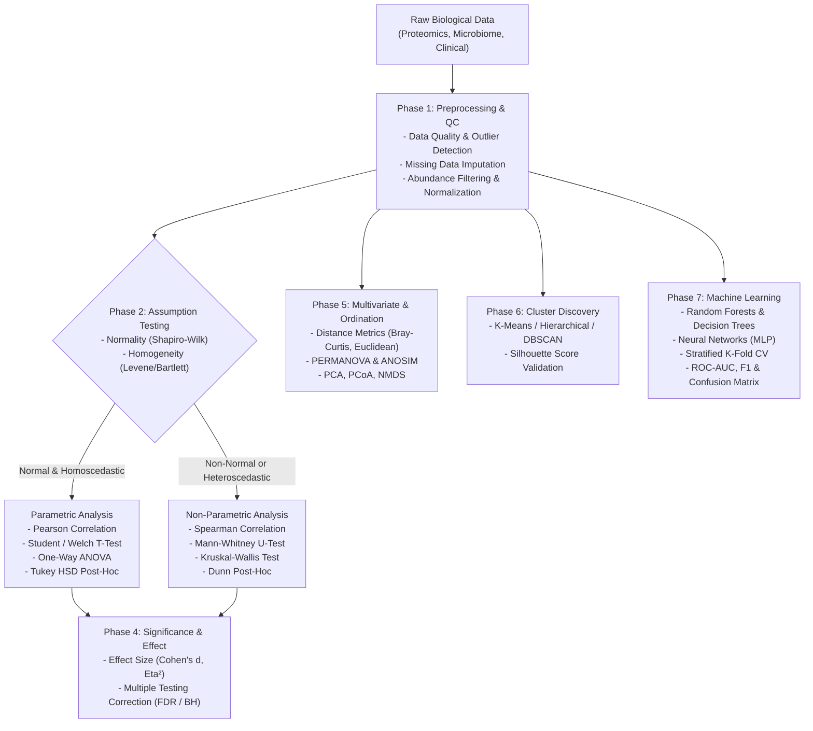

# 📊 Biostatistics in Python: End-to-End Workflow & Reference Guide

[](https://www.python.org/)
[](LICENSE)
[](https://scikit-learn.org/)
[](https://scipy.org/)
[](https://www.statsmodels.org/)

Ein umfassendes, modular aufgebautes Framework für moderne **Biostatistik, multivariate Analysen und Machine Learning in Python** – inklusive direkter **R-zu-Python-Mappings**, statistischer Entscheidungsbäume und Best Practices für wissenschaftliche Auswertungen und Präsentationen.

---

## 📑 Inhaltsverzeichnis

- [🎯 Workflow-Pipeline & Architektur](#-workflow-pipeline--architektur)
- [🧭 Statistische Entscheidungsmatrix (Cheat Sheet)](#-statistische-entscheidungsmatrix-cheat-sheet)
- [🔬 Phase 1: Datenqualität & Vorverarbeitung](#-phase-1-datenqualität--vorverarbeitung)
  - [1. Data Quality Assessment](#1-data-quality-assessment)
  - [2. Missing Data Handling](#2-missing-data-handling)
  - [3. Abundance-Threshold Filtering](#3-abundance-threshold-filtering)
  - [4. Normalization & Feature Scaling](#4-normalization--feature-scaling)
- [📐 Phase 2: Statistische Voraussetzungsprüfungen](#-phase-2-statistische-voraussetzungsprüfungen)
  - [5. Shapiro-Wilk & Normalverteilungstests](#5-shapiro-wilk--normalverteilungstests)
  - [6. Varianzhomogenitäts-Tests (Homoskedastizität)](#6-varianzhomogenitäts-tests-homoskedastizität)
- [🧪 Phase 3: Hypothesentests & Assoziationen](#-phase-3-hypothesentests--assoziationen)
  - [7. Pearson & Spearman Korrelation](#7-pearson--spearman-korrelation)
  - [8. Zwei-Gruppen-Vergleiche: T-Test & Mann-Whitney U-Test](#8-zwei-gruppen-vergleiche-t-test--mann-whitney-u-test)
  - [9. Mehrgruppen-Vergleiche: ANOVA & Kruskal-Wallis Test](#9-mehrgruppen-vergleiche-anova--kruskal-wallis-test)
- [🎯 Phase 4: Post-Hoc Tests, Effektstärken & Multiple Testing](#-phase-4-post-hoc-tests-effektstärken--multiple-testing)
  - [10. Post-Hoc Tests (Paarweise Vergleiche)](#10-post-hoc-tests-paarweise-vergleiche)
  - [11. Effektstärken-Berechnung (Effect Size)](#11-effektstärken-berechnung-effect-size)
  - [12. False Discovery Rate (FDR) & Signifikanzkontrolle](#12-false-discovery-rate-fdr--signifikanzkontrolle)
- [🌐 Phase 5: Multivariate Statistik & Ordination](#-phase-5-multivariate-statistik--ordination)
  - [13. ANOSIM & PERMANOVA](#13-anosim--permanova)
  - [14. Ordination: PCA, PCoA & NMDS](#14-ordination-pca-pcoa--nmds)
- [🔍 Phase 6: Unsupervised Learning & Clustering](#-phase-6-unsupervised-learning--clustering)
  - [15. K-Means, Hierarchisches Clustering & DBSCAN](#15-k-means-hierarchisches-clustering--dbscan)
- [🤖 Phase 7: Supervised Machine Learning & Validierung](#-phase-7-supervised-machine-learning--validierung)
  - [16. Entscheidungsbäume & Neuronale Netze (MLP)](#16-entscheidungsbäume--neuronale-netze-mlp)
  - [17. Random Forests & Ensemble Learning](#17-random-forests--ensemble-learning)
  - [18. Cross-Validation Strategien](#18-cross-validation-strategien)
  - [19. Model Evaluation & Performance Metrics](#19-model-evaluation--performance-metrics)
- [🧬 Phase 8: Mengen- & Überlappungsanalysen (Venn & UpSet)](#-phase-8-mengen--überlappungsanalysen-venn--upset)
  - [20. Venn-Diagramme & UpSet-Plots](#20-venn-diagramme--upset-plots)
- [🔄 R vs. Python Übersetzungstabelle](#-r-vs-python-übersetzungstabelle)
- [🚀 Installation & Setup](#-installation--setup)
- [📄 Lizenz](#-lizenz)

---

## 🎯 Workflow-Pipeline & Architektur

Die folgende Pipeline zeigt den idealtypischen Ablauf einer biostatistischen Datenanalyse von den Rohdaten bis hin zur prädiktiven Modellierung:



---

## 🧭 Statistische Entscheidungsmatrix (Cheat Sheet)

| Forschungsfrage / Datentyp | Normalverteilt? | Varianz homogen? | Empfohlene Methode | Python Funktion / Bibliothek | R Äquivalent |
| :--- | :--- | :--- | :--- | :--- | :--- |
| **2 Gruppen vergleichen** | Ja | Ja | **Two-Sample T-Test** | `scipy.stats.ttest_ind(equal_var=True)` | `t.test(var.equal=TRUE)` |
| **2 Gruppen vergleichen** | Ja | Nein | **Welch's T-Test** | `scipy.stats.ttest_ind(equal_var=False)` | `t.test(var.equal=FALSE)` |
| **2 Gruppen vergleichen** | Nein / Ordinal | Egal | **Mann-Whitney U-Test** | `scipy.stats.mannwhitneyu()` | `wilcox.test()` |
| **≥ 3 Gruppen vergleichen** | Ja | Ja | **One-Way ANOVA** | `scipy.stats.f_oneway()` | `aov()` / `anova()` |
| **≥ 3 Gruppen vergleichen** | Nein / Ordinal | Egal | **Kruskal-Wallis Test** | `scipy.stats.kruskal()` | `kruskal.test()` |
| **Paarweiser Post-Hoc Test** | Ja (nach ANOVA) | Ja | **Tukey HSD** | `statsmodels.stats.multicomp.pairwise_tukeyhsd()` | `TukeyHSD()` |
| **Paarweiser Post-Hoc Test** | Nein (nach Kruskal) | Egal | **Dunn's Test** | `scikit_posthocs.posthoc_dunn()` | `FSA::dunnTest()` |
| **Zusammenhang zweier Variablen** | Ja | Linear | **Pearson Korrelation** | `scipy.stats.pearsonr()` | `cor(method='pearson')` |
| **Zusammenhang zweier Variablen** | Nein / Monoton | Monoton | **Spearman Korrelation** | `scipy.stats.spearmanr()` | `cor(method='spearman')` |
| **Multivariate Gruppenunterschiede** | Nicht-parametrisch | Distanzmatrix | **PERMANOVA / ANOSIM** | `skbio.stats.distance.permanova()` | `vegan::adonis()` |
| **Dimensionsreduktion (Linear)** | Kontinuierlich | Skaliert | **PCA** | `sklearn.decomposition.PCA()` | `prcomp()` |
| **Dimensionsreduktion (Nicht-linear)** | Distanzbasiert | Egal | **NMDS / PCoA** | `sklearn.manifold.MDS()` | `vegan::metaMDS()` |
| **Mengenüberlappung (2–4 Gruppen)** | Kategorial / Sets | Listen | **Venn-Diagramm** | `venny4py.venny4py()` | `VennDiagram::venn.diagram()` |
| **Mengenüberlappung (≥ 5 Gruppen)** | Kategorial / Sets | Listen | **UpSet Plot** | `upsetplot.UpSet()` | `UpSetR::upset()` |

---

## 🔬 Phase 1: Datenqualität & Vorverarbeitung

### 1. Data Quality Assessment
- **Ziel & Anwendungsfall:** Frühzeitige Erkennung von Datenlücken, Messfehlern, Schiefe und extremen Ausreißern vor allen statistischen Berechnungen.
- **Entscheidungskriterien:**
  - Standard-Ausreißererkennung über den Interquartilsabstand ($IQR = Q_3 - Q_1$): Ausreißer liegen außerhalb $[Q_1 - 1.5 \cdot IQR, Q_3 + 1.5 \cdot IQR]$.
  - Visualisierung von Fehlwertmustern (MNAR vs. MCAR) mittels Matrix-Plots.
- **R vs. Python:**
  - R: `VIM::aggr()`, `summary(data)`, `boxplot.stats()$out`
  - Python: `missingno.matrix()`, `pandas.DataFrame.describe()`, Quantil-Berechnung mit `df.quantile()`

```python
import pandas as pd
import missingno as msno

df = pd.read_csv("data.csv", index_col=0)

# 1. Dateninspektion & Fehlwert-Matrix
print(df.info())
msno.matrix(df)

# 2. IQR-Ausreißeranalyse
Q1, Q3 = df.quantile(0.25), df.quantile(0.75)
IQR = Q3 - Q1
outliers = ((df < (Q1 - 1.5 * IQR)) | (df > (Q3 + 1.5 * IQR))).sum()
print("Ausreißer pro Feature:\n", outliers)
```

---

### 2. Missing Data Handling
- **Ziel & Anwendungsfall:** Systematische Behandlung fehlender Werte je nach Mechanismus (MCAR, MAR, MNAR).
- **Entscheidungskriterien:**
  - **Complete Case Analysis (Drop):** Nur bei MCAR und $<5\%$ Fehlwerten.
  - **Simple Imputation (Median / Mean):** Bei MAR mit geringer Fehlquote ($<10\%$).
  - **KNN / Iterative Imputation:** Bei MAR mit hohem Fehlwertanteil ($>10\%$), um Korrelationen zwischen Features zu erhalten.
- **R vs. Python:**
  - R: `mice::mice(m=5, method='pmm')`, `Hmisc::impute(x, median)`, `VIM::kNN()`
  - Python: `sklearn.impute.SimpleImputer`, `sklearn.impute.KNNImputer`, `sklearn.impute.IterativeImputer`

```python
from sklearn.impute import KNNImputer, SimpleImputer

# Simple Imputation (Median)
simple_imp = SimpleImputer(strategy='median')
df_median = pd.DataFrame(simple_imp.fit_transform(df), columns=df.columns, index=df.index)

# K-Nearest Neighbors Imputation
knn_imp = KNNImputer(n_neighbors=5)
df_imputed = pd.DataFrame(knn_imp.fit_transform(df), columns=df.columns, index=df.index)
```

---

### 3. Abundance-Threshold Filtering
- **Ziel & Anwendungsfall:** Reduktion von Messrauschen und Korrekturaufwand für multiples Testen in hochdimensionalen Omics-Daten (Metabolomik, Mikrobiom, Proteomik).
- **Entscheidungskriterien:**
  - **Prävalenzfilter:** Feature muss in mindestens $X\%$ (z. B. 10%) der Proben nachgewiesen sein ($>0$).
  - **Abundanzfilter:** Relative Abundanz $>0.1\%$ in mindestens $k$ Proben.
  - **Varianzfilter:** Entfernen von Features mit nahezu konstanter Expression via `VarianceThreshold`.
- **R vs. Python:**
  - R: `edgeR::cpm()`, `rowSums(data > 0) >= threshold`, `sweep()`
  - Python: `(df > 0).sum() / len(df)`, `df.div(df.sum(axis=1), axis=0)`, `sklearn.feature_selection.VarianceThreshold`

```python
from sklearn.feature_selection import VarianceThreshold

# 1. Prävalenz-Filter (mind. 10% der Proben)
prevalence = (df > 0).sum(axis=0) / len(df)
df_filtered = df.loc[:, prevalence >= 0.10]

# 2. Relative Abundanz (mind. 0.1% in mindestens 3 Proben)
rel_abund = df.div(df.sum(axis=1), axis=0)
keep_features = (rel_abund > 0.001).sum(axis=0) >= 3
df_abund_filtered = df.loc[:, keep_features]

# 3. Varianzfilter
selector = VarianceThreshold(threshold=0.01)
df_var_filtered = pd.DataFrame(
    selector.fit_transform(df),
    columns=df.columns[selector.get_support()],
    index=df.index
)
```

---

### 4. Normalization & Feature Scaling
- **Ziel & Anwendungsfall:** Vereinheitlichung unterschiedlicher Messskalen und Stabilisierung der Varianz.
- **Entscheidungskriterien:**
  - **Z-Score (`StandardScaler`):** Mittelwert 0, Std. 1. Standard vor PCA, Clustering und Regressionen.
  - **Min-Max Scaling (`MinMaxScaler`):** Skalierung auf $[0, 1]$. Optimal für neuronale Netze und bounded Inputs.
  - **Robust Scaling (`RobustScaler`):** Basiert auf Median und IQR. Resistent gegen extreme Ausreißer.
  - **Log-Transformation ($\log(x+1)$):** Bei rechtsschiefen Verteilungen und Fold-Change-Daten.
- **R vs. Python:**
  - R: `scale(data)`, `log(data + 1)`
  - Python: `sklearn.preprocessing.StandardScaler`, `MinMaxScaler`, `RobustScaler`, `numpy.log1p`

```python
from sklearn.preprocessing import StandardScaler, MinMaxScaler, RobustScaler
import numpy as np

# Z-Score Standardisierung
scaler = StandardScaler()
df_zscore = pd.DataFrame(scaler.fit_transform(df), columns=df.columns, index=df.index)

# Log1p Transformation: log(x + 1)
df_log = np.log1p(df)

# Robustes Scaling (Median/IQR)
robust_scaler = RobustScaler()
df_robust = pd.DataFrame(robust_scaler.fit_transform(df), columns=df.columns, index=df.index)
```

---

## 📐 Phase 2: Statistische Voraussetzungsprüfungen

### 5. Shapiro-Wilk & Normalverteilungstests
- **Ziel & Anwendungsfall:** Überprüfung der Normalverteilungsannahme zur Auswahl zwischen parametrischen und nicht-parametrischen Tests.
- **Entscheidungskriterien:**
  - $N < 50$: **Shapiro-Wilk Test** (höchste Teststärke).
  - $50 \le N \le 200$: **Anderson-Darling Test**.
  - $N > 200$: **Kolmogorov-Smirnov Test** oder Q-Q-Plot / D'Agostino-Pearson.
  - Signifikanzniveau: $p > 0.05 \implies$ Normalverteilung kann angenommen werden.
- **R vs. Python:**
  - R: `shapiro.test(x)`, `nortest::ad.test(x)`, `qqnorm(x); qqline(x)`
  - Python: `scipy.stats.shapiro()`, `scipy.stats.anderson()`, `scipy.stats.probplot()`

```python
from scipy import stats
import matplotlib.pyplot as plt

# Shapiro-Wilk Test für einzelne Variable
stat, p_val = stats.shapiro(df['Protein_1'].dropna())
print(f"Shapiro-Wilk: W={stat:.4f}, p={p_val:.4f} -> {'Normal' if p_val > 0.05 else 'Nicht-Normal'}")

# Q-Q Plot zur visuellen Inspektion
stats.probplot(df['Protein_1'].dropna(), dist="norm", plot=plt)
plt.title("Q-Q Plot: Protein_1")
plt.show()
```

---

### 6. Varianzhomogenitäts-Tests (Homoskedastizität)
- **Ziel & Anwendungsfall:** Prüfung gleicher Varianzen zwischen Gruppen als Voraussetzung für Standard-ANOVA und pooled T-Tests.
- **Entscheidungskriterien:**
  - **Levene-Test (Center=Mean/Median):** Robust gegen moderate Abweichungen von der Normalverteilung.
  - **Bartlett-Test:** Höhere Trennschärfe, setzt jedoch zwingend normalverteilte Daten voraus.
  - **Fligner-Killeen:** Vollständig nicht-parametrischer Test bei starker Schiefe.
  - Entscheidung: Wenn $p < 0.05 \implies$ Varianzen ungleich $\implies$ Welch's ANOVA bzw. Welch's T-Test nutzen!
- **R vs. Python:**
  - R: `car::leveneTest(response ~ group)`, `bartlett.test()`, `fligner.test()`
  - Python: `scipy.stats.levene()`, `scipy.stats.bartlett()`, `scipy.stats.fligner()`

```python
from scipy import stats

groups = [group['response'].values for _, group in df.groupby('group')]

# Levene-Test (robust)
stat_levene, p_levene = stats.levene(*groups, center='median')
print(f"Levene-Test: W={stat_levene:.3f}, p={p_levene:.4f}")

if p_levene > 0.05:
    print("✓ Varianzen homogen: Standard-ANOVA / Standard-T-Test zulässig")
else:
    print("✗ Varianzen heterogen: Welch-Korrektur erforderlich")
```

---

## 🧪 Phase 3: Hypothesentests & Assoziationen

### 7. Pearson & Spearman Korrelation
- **Ziel & Anwendungsfall:** Quantifizierung von linearen oder monotonen Zusammenhängen zwischen kontinuierlichen oder ordinalen Merkmalen.
- **Entscheidungskriterien:**
  - **Pearson $r$:** Beide Variablen normalverteilt, linearer Zusammenhang.
  - **Spearman $\rho$:** Nicht-normalverteilt, monotone Beziehung oder ordinale Skalierung.
  - **Kendall $\tau$:** Kleine Stichproben mit vielen Rangbindungen (Ties).
- **R vs. Python:**
  - R: `cor(x, y, method="pearson")`, `cor.test()`
  - Python: `scipy.stats.pearsonr()`, `scipy.stats.spearmanr()`, `df.corr()`

```python
from scipy import stats

x, y = df['Feature_A'].dropna(), df['Feature_B'].dropna()

# Pearson (parametrisch)
r_p, p_p = stats.pearsonr(x, y)
print(f"Pearson r = {r_p:.3f} (p = {p_p:.4e})")

# Spearman (Rangkorrelation, nicht-parametrisch)
r_s, p_s = stats.spearmanr(x, y)
print(f"Spearman rho = {r_s:.3f} (p = {p_s:.4e})")
```

---

### 8. Zwei-Gruppen-Vergleiche: T-Test & Mann-Whitney U-Test
- **Ziel & Anwendungsfall:** Vergleich der Lageparameter zweier unabhängiger oder gepaarter biologischer Gruppen (z. B. Treatment vs. Control).
- **Entscheidungskriterien:**
  - **Unabhängige Stichproben:**
    - Normalverteilt $\implies$ `stats.ttest_ind(g1, g2, equal_var=...)` (Student vs. Welch)
    - Nicht-normalverteilt $\implies$ `stats.mannwhitneyu(g1, g2)`
  - **Gepaarte Stichproben (Pre/Post):**
    - Normalverteilt $\implies$ `stats.ttest_rel(pre, post)`
    - Nicht-normalverteilt $\implies$ `stats.wilcoxon(pre, post)`
- **R vs. Python:**
  - R: `t.test(g1, g2, paired=FALSE, var.equal=TRUE)`, `wilcox.test()`
  - Python: `scipy.stats.ttest_ind()`, `scipy.stats.mannwhitneyu()`, `scipy.stats.wilcoxon()`

```python
from scipy import stats

g1 = df[df['condition'] == 'Control']['abundance']
g2 = df[df['condition'] == 'Treated']['abundance']

# Normalitätsprüfung beider Gruppen
_, p_norm1 = stats.shapiro(g1)
_, p_norm2 = stats.shapiro(g2)

if p_norm1 > 0.05 and p_norm2 > 0.05:
    stat, p_val = stats.ttest_ind(g1, g2, equal_var=False) # Welch's t-test
    print(f"Welch's T-Test: t={stat:.3f}, p={p_val:.4f}")
else:
    stat, p_val = stats.mannwhitneyu(g1, g2, alternative='two-sided')
    print(f"Mann-Whitney U-Test: U={stat:.3f}, p={p_val:.4f}")
```

---

### 9. Mehrgruppen-Vergleiche: ANOVA & Kruskal-Wallis Test
- **Ziel & Anwendungsfall:** Vergleich von drei oder mehr unabhängigen Gruppen zur Vermeidung von $\alpha$-Fehler-Kumulierung.
- **Entscheidungskriterien:**
  - Normalverteilt & Varianzen homogen $\implies$ **One-Way ANOVA** (`f_oneway`).
  - Verletzte Annahmen $\implies$ **Kruskal-Wallis H-Test** (`kruskal`).
  - Bei Signifikanz ($p < 0.05$) immer nachfolgende **Post-Hoc Tests** durchführen!
- **R vs. Python:**
  - R: `aov(response ~ group, data=df)`, `kruskal.test()`
  - Python: `scipy.stats.f_oneway()`, `scipy.stats.kruskal()`

```python
from scipy import stats

groups = [group['abundance'].values for _, group in df.groupby('treatment_group')]

# ANOVA (Parametrisch)
f_stat, p_anova = stats.f_oneway(*groups)
print(f"One-Way ANOVA: F = {f_stat:.3f}, p = {p_anova:.4e}")

# Kruskal-Wallis (Nicht-parametrisch)
h_stat, p_kruskal = stats.kruskal(*groups)
print(f"Kruskal-Wallis: H = {h_stat:.3f}, p = {p_kruskal:.4e}")
```

---

## 🎯 Phase 4: Post-Hoc Tests, Effektstärken & Multiple Testing

### 10. Post-Hoc Tests (Paarweise Vergleiche)
- **Ziel & Anwendungsfall:** Identifikation konkreter Gruppenunterschiede nach signifikantem Omnibus-Test (ANOVA / Kruskal-Wallis).
- **Entscheidungskriterien:**
  - **Nach ANOVA (gleiche Varianzen):** Tukey HSD (`pairwise_tukeyhsd`).
  - **Nach ANOVA (ungleiche Varianzen):** Games-Howell Test (`posthoc_gameshowell`).
  - **Nach Kruskal-Wallis:** Dunn's Test mit Bonferroni- oder Holm-Korrektur (`posthoc_dunn`).
- **R vs. Python:**
  - R: `TukeyHSD()`, `FSA::dunnTest()`, `pairwise.t.test(p.adjust="bonferroni")`
  - Python: `statsmodels.stats.multicomp.pairwise_tukeyhsd`, `scikit_posthocs.posthoc_dunn`

```python
from statsmodels.stats.multicomp import pairwise_tukeyhsd
import scikit_posthocs as sp

# 1. Tukey HSD (nach ANOVA)
tukey = pairwise_tukeyhsd(endog=df['abundance'], groups=df['treatment_group'], alpha=0.05)
print(tukey.summary())

# 2. Dunn's Post-Hoc Test (nach Kruskal-Wallis)
dunn = sp.posthoc_dunn(df, val_col='abundance', group_col='treatment_group', p_adjust='fdr_bh')
print("Dunn Test p-Werte (FDR-adjustiert):\n", dunn)
```

---

### 11. Effektstärken-Berechnung (Effect Size)
- **Ziel & Anwendungsfall:** Quantifizierung der praktischen/biologischen Relevanz unabhängig von der Stichprobengröße $N$.
- **Wichtigste Metriken:**
  - **Cohen's $d$ (2 Gruppen):** 
    $$d = \frac{\bar{x}_1 - \bar{x}_2}{s_{\text{pooled}}}$$
    - Richtwerte: $|d| < 0.2$ (vernachlässigbar), $0.2-0.5$ (klein), $0.5-0.8$ (mittel), $> 0.8$ (groß).
  - **Eta-Quadrat $\eta^2$ (ANOVA):** Anteil der erklärten Gesamtvarianz:
    $$\eta^2 = \frac{SS_{\text{between}}}{SS_{\text{total}}}$$
  - **Cramér's $V$ (Kontingenztabellen):** Assoziationsstärke kategorialer Merkmale.
- **R vs. Python:**
  - R: `effsize::cohen.d()`, `lsr::etaSquared()`, `lsr::cramersV()`
  - Python: Eigene Vektorisierung oder `scipy.stats.contingency.association`

```python
import numpy as np

def cohens_d(g1, g2):
    n1, n2 = len(g1), len(g2)
    s_pooled = np.sqrt(((n1 - 1) * g1.var(ddof=1) + (n2 - 1) * g2.var(ddof=1)) / (n1 + n2 - 2))
    return (g1.mean() - g2.mean()) / s_pooled

d_val = cohens_d(g1, g2)
print(f"Cohen's d: {d_val:.3f}")
```

---

### 12. False Discovery Rate (FDR) & Signifikanzkontrolle
- **Ziel & Anwendungsfall:** Kontrolle falsch-positiver Entdeckungen bei simultaner Testung hunderter bis tausender Gene, Proteine oder Metabolite.
- **Entscheidungskriterien:**
  - **Benjamini-Hochberg (FDR / BH):** Standard für High-Throughput-Omics; maximiert statistische Power bei kontrollierter Fehlerrate.
  - **Bonferroni (FWER):** Sehr konservativ ($\alpha / m$), erhöht das Risiko falsch-negativer Befunde (Typ-II-Fehler).
  - **Holm-Bonferroni:** Sequentiell verwerfend, trennschärfer als Standard-Bonferroni.
- **R vs. Python:**
  - R: `p.adjust(p_values, method = "BH")`
  - Python: `statsmodels.stats.multitest.multipletests()`

```python
from statsmodels.stats.multitest import multipletests
import numpy as np

p_values = [0.001, 0.004, 0.012, 0.045, 0.08, 0.23, 0.89]

# Benjamini-Hochberg FDR
rejected_bh, p_adj_bh, _, _ = multipletests(p_values, alpha=0.05, method='fdr_bh')

# Bonferroni
rejected_bonf, p_adj_bonf, _, _ = multipletests(p_values, alpha=0.05, method='bonferroni')

print(f"Signifikant nach FDR: {np.sum(rejected_bh)} / {len(p_values)}")
print(f"Signifikant nach Bonferroni: {np.sum(rejected_bonf)} / {len(p_values)}")
```

---

## 🌐 Phase 5: Multivariate Statistik & Ordination

### 13. ANOSIM & PERMANOVA
- **Ziel & Anwendungsfall:** Multivariate Hypothesentests zum Nachweis von Unterschieden in der Gesamt-Zusammensetzung (z. B. Mikrobiom-Profile zwischen Phänotypen).
- **Entscheidungskriterien:**
  - **PERMANOVA (Permutational ANOVA):** Testet Unterschiede zwischen Gruppen-Zentroiden im Distanzraum. Höhere Flexibilität.
  - **ANOSIM (Analysis of Similarities):** Rangbasierter Vergleich der Distanzen innerhalb vs. zwischen Gruppen ($R \in [-1, 1]$; $R > 0.75 \implies$ stark separiert).
  - **Distanzmaße:** Bray-Curtis (Ökologie/Count-Abundanzen), Euklidisch (skalierte kontinuierliche Daten).
- **R vs. Python:**
  - R: `vegan::anosim()`, `vegan::adonis()`
  - Python: `skbio.stats.distance.anosim()`, `skbio.stats.distance.permanova()`, `scipy.spatial.distance.pdist`

```python
from skbio.stats.distance import anosim, permanova
from skbio import DistanceMatrix
from scipy.spatial.distance import pdist, squareform

# 1. Bray-Curtis Distanzmatrix erstellen
dist_array = pdist(df_counts, metric='braycurtis')
dm = DistanceMatrix(squareform(dist_array), ids=df_counts.index)

# 2. PERMANOVA Test
perm_res = permanova(dm, grouping=df_metadata['Group'], permutations=999)
print(f"PERMANOVA: pseudo-F = {perm_res['test statistic']:.3f}, p = {perm_res['p-value']:.4f}")

# 3. ANOSIM Test
anosim_res = anosim(dm, grouping=df_metadata['Group'], permutations=999)
print(f"ANOSIM: R = {anosim_res['test statistic']:.3f}, p = {anosim_res['p-value']:.4f}")
```

---

### 14. Ordination: PCA, PCoA & NMDS
- **Ziel & Anwendungsfall:** Dimensionsreduktion und 2D/3D-Visualisierung hochdimensionaler biologischer Datensätze.
- **Entscheidungskriterien:**
  - **PCA (Principal Component Analysis):** Für kontinuierliche, normalisierte Daten; maximiert erklärte Varianz (lineare Projektion).
  - **PCoA (Principal Coordinate Analysis):** Metrische MDS basierend auf beliebigen Distanzmatrizen (z. B. Bray-Curtis, Jaccard).
  - **NMDS (Non-metric Multidimensional Scaling):** Rangbasierte iterative Einbettung. Erhält Rangabstände; Stress-Wert $< 0.1$ ideal, $< 0.2$ akzeptabel.
- **R vs. Python:**
  - R: `prcomp(scale=TRUE)`, `vegan::cmdscale()`, `vegan::metaMDS()`
  - Python: `sklearn.decomposition.PCA`, `sklearn.manifold.MDS`

```python
from sklearn.decomposition import PCA
from sklearn.manifold import MDS
from sklearn.preprocessing import StandardScaler

# PCA (Linear)
X_scaled = StandardScaler().fit_transform(df)
pca = PCA(n_components=2)
pca_coords = pca.fit_transform(X_scaled)
print(f"Erklärte Varianz (PC1 + PC2): {sum(pca.explained_variance_ratio_):.1%}")

# NMDS (Nicht-metrisch)
nmds = MDS(n_components=2, metric=False, random_state=42, dissimilarity='euclidean')
nmds_coords = nmds.fit_transform(X_scaled)
print(f"NMDS Stress: {nmds.stress_:.3f}")
```

---

## 🔍 Phase 6: Unsupervised Learning & Clustering

### 15. K-Means, Hierarchisches Clustering & DBSCAN
- **Ziel & Anwendungsfall:** Entdeckung unüberwachter Proben- oder Biomarker-Subgruppen (Stratifizierung).
- **Entscheidungskriterien:**
  - **K-Means:** Sphärische, gleich große Cluster; Anzahl $k$ muss vorab definiert werden (Elbow / Silhouette Score).
  - **Hierarchisches Clustering (Agglomerativ / Ward):** Erzeugt Dendrogramme; ideal für explorative Genexpressions-Cluster.
  - **DBSCAN:** Erkennt Cluster beliebiger Form und filtert Messrauschen/Ausreißer automatisch aus.
- **R vs. Python:**
  - R: `factoextra::eclust(type="kmeans")`, `NbClust()`, `fpc::dbscan()`
  - Python: `sklearn.cluster.KMeans`, `AgglomerativeClustering`, `DBSCAN`, `sklearn.metrics.silhouette_score`

```python
from sklearn.cluster import KMeans, AgglomerativeClustering, DBSCAN
from sklearn.metrics import silhouette_score

# 1. K-Means mit optimalem Silhouette Score
kmeans = KMeans(n_clusters=3, random_state=42, n_init='auto').fit(X_scaled)
score_km = silhouette_score(X_scaled, kmeans.labels_)
print(f"K-Means Silhouette Score: {score_km:.3f}")

# 2. Hierarchisches Clustering (Ward Linkage)
hier = AgglomerativeClustering(n_clusters=3, linkage='ward').fit(X_scaled)

# 3. DBSCAN (Dichtebasiert)
dbscan = DBSCAN(eps=1.5, min_samples=4).fit(X_scaled)
```

---

## 🤖 Phase 7: Supervised Machine Learning & Validierung

### 16. Entscheidungsbäume & Neuronale Netze (MLP)
- **Ziel & Anwendungsfall:** Phänotyp-Klassifikation und Biomarker-Selektion mittels überwachter Lernalgorithmen.
- **Entscheidungskriterien:**
  - **Decision Trees (`DecisionTreeClassifier`):** Hohe Interpretierbarkeit, native Feature-Wichtigkeit, keine lineare Annahme.
  - **Neural Networks (`MLPClassifier`):** Für hochgradig nicht-lineare Interaktionsmuster und große Datensätze (erfordert Standardisierung).
- **R vs. Python:**
  - R: `rpart::rpart()`, `neuralnet::neuralnet()`
  - Python: `sklearn.tree.DecisionTreeClassifier`, `sklearn.neural_network.MLPClassifier`

```python
from sklearn.tree import DecisionTreeClassifier
from sklearn.neural_network import MLPClassifier
from sklearn.model_selection import train_test_split

X_train, X_test, y_train, y_test = train_test_split(X_scaled, y, test_size=0.25, random_state=42)

# Entscheidungsbaum mit Tiefenbegrenzung
dt = DecisionTreeClassifier(max_depth=4, random_state=42).fit(X_train, y_train)

# MLP Multi-Layer Perceptron
mlp = MLPClassifier(hidden_layer_sizes=(32, 16), max_iter=500, random_state=42).fit(X_train, y_train)
```

---

### 17. Random Forests & Ensemble Learning
- **Ziel & Anwendungsfall:** Robuste Ensemble-Klassifikation mit hoher Generalisierungsfähigkeit und stabiler Rangfolge relevanter Biomarker (Feature Importance).
- **Entscheidungskriterien:**
  - Reduziert Varianz und Overfitting von Einzelbäumen via Bagging und Random Subspace.
  - **Out-of-Bag (OOB) Score:** Unverzerrte interne Validierung ohne separaten Validierungs-Split.
- **R vs. Python:**
  - R: `randomForest::randomForest(importance=TRUE)`, `ranger::ranger()`
  - Python: `sklearn.ensemble.RandomForestClassifier`, `sklearn.ensemble.RandomForestRegressor`

```python
from sklearn.ensemble import RandomForestClassifier
import pandas as pd

rf = RandomForestClassifier(
    n_estimators=500,
    max_depth=8,
    min_samples_split=4,
    oob_score=True,
    random_state=42,
    n_jobs=-1
)
rf.fit(X_train, y_train)

print(f"OOB Accuracy: {rf.oob_score_:.3f}")

# Top 5 wichtigste Biomarker
feat_imp = pd.Series(rf.feature_importances_, index=df.columns[:-1]).sort_values(ascending=False)
print("Top 5 Biomarker:\n", feat_imp.head(5))
```

---

### 18. Cross-Validation Strategien
- **Ziel & Anwendungsfall:** Unverzerrte Schätzung der Modellgüte auf unbekannten biologischen Daten.
- **Entscheidungskriterien:**
  - **Stratified K-Fold:** Zwingend bei unbalancierten Klassen (z. B. seltene Krankheiten), um Klassenverhältnisse pro Fold beizubehalten.
  - **Standard K-Fold:** Für Regressionsmodelle und balancierte Datensätze.
  - **Leave-One-Out (LOOCV):** Bei sehr kleinen klinischen Kohorten ($N < 30$).
- **R vs. Python:**
  - R: `caret::trainControl(method="cv", number=5)`, `caret::createFolds()`
  - Python: `sklearn.model_selection.StratifiedKFold`, `cross_val_score`

```python
from sklearn.model_selection import StratifiedKFold, cross_val_score

cv = StratifiedKFold(n_splits=5, shuffle=True, random_state=42)
scores = cross_val_score(rf, X_scaled, y, cv=cv, scoring='accuracy')

print(f"5-Fold CV Accuracy: {scores.mean():.3f} (+/- {scores.std():.3f})")
```

---

### 19. Model Evaluation & Performance Metrics
- **Ziel & Anwendungsfall:** Ganzheitliche Bewertung von Klassifikatoren jenseits der reinen Accuracy.
- **Wichtigste Kennzahlen:**
  - **Confusion Matrix:** True Positive, False Positive, True Negative, False Negative.
  - **Precision & Recall (Sensitivity):** $\text{Recall} = \frac{TP}{TP + FN}$, $\text{Precision} = \frac{TP}{TP + FP}$.
  - **F1-Score:** Harmonisches Mittel aus Precision und Recall.
  - **ROC-AUC:** Diskriminationsfähigkeit über alle Schwellenwerte hinweg (Fläche unter der ROC-Kurve).
- **R vs. Python:**
  - R: `caret::confusionMatrix()`, `pROC::roc()`, `pROC::auc()`
  - Python: `sklearn.metrics.classification_report`, `roc_auc_score`, `confusion_matrix`

```python
from sklearn.metrics import classification_report, confusion_matrix, roc_auc_score

y_pred = rf.predict(X_test)
y_prob = rf.predict_proba(X_test)[:, 1]

print("Klassifikationsbericht:\n", classification_report(y_test, y_pred))
print("Confusion Matrix:\n", confusion_matrix(y_test, y_pred))
print(f"ROC-AUC Score: {roc_auc_score(y_test, y_prob):.3f}")
```

---

## 🧬 Phase 8: Mengen- & Überlappungsanalysen (Venn & UpSet)

### 20. Venn-Diagramme & UpSet-Plots
- **Ziel & Anwendungsfall:** Schnittmengen, disjunkte Teilmengen und gemeinsame Biomarker-Kerne über 2–20+ Proben-, Gen- oder Proteingruppen hinweg visualisieren.
- **Entscheidungskriterien:**
  - **2–4 Gruppen:** Klassisches Venn-Diagramm via `venny4py` (intuitiver visueller Überblick).
  - **≥ 5 Gruppen:** Matrix-basiertes UpSet-Diagramm via `upsetplot` (skaliert verlustfrei und verhindert unleserliche 5+-Wege-Venn-Überlappungen).
- **R vs. Python:**
  - R: `VennDiagram::venn.diagram()`, `UpSetR::upset()`
  - Python: `venny4py.venny4py`, `upsetplot.UpSet`

```python
from upsetplot import UpSet, from_contents
from venny4py.venny4py import venny4py

# 1. 4-Wege Venn-Diagramm (venny4py)
venny4py(sets=sample_sets_4way, out="venn_4_output", ext="png", dpi=300)

# 2. Skalierbarer UpSet Plot (upsetplot)
upset = UpSet(from_contents(sample_sets_10way), subset_size="count", show_counts=True)
upset.plot()
```

---

## 🔄 R vs. Python Übersetzungstabelle

Eine komprimierte Übersicht für Biostatistiker und Data Scientists, die zwischen R und Python wechseln:

| Domäne / Aufgabe | R Funktion / Paket | Python Funktion / Bibliothek |
| :--- | :--- | :--- |
| **Data Summary** | `summary(df)`, `str(df)` | `df.describe()`, `df.info()` |
| **Missing Pattern** | `VIM::aggr()`, `mice::md.pattern()` | `missingno.matrix()`, `missingno.heatmap()` |
| **Imputation** | `mice(m=5, method='pmm')` | `sklearn.impute.KNNImputer()`, `IterativeImputer()` |
| **Z-Score Normalisierung** | `scale(x)` | `sklearn.preprocessing.StandardScaler()` |
| **Normalitätsprüfung** | `shapiro.test(x)` | `scipy.stats.shapiro(x)` |
| **Varianzhomogenität** | `car::leveneTest()` | `scipy.stats.levene()` |
| **T-Test (2 Gruppen)** | `t.test(x, y)` | `scipy.stats.ttest_ind(x, y)` |
| **Mann-Whitney U-Test** | `wilcox.test(x, y)` | `scipy.stats.mannwhitneyu(x, y)` |
| **ANOVA (≥ 3 Gruppen)** | `aov(y ~ group)` | `scipy.stats.f_oneway(*groups)` |
| **Kruskal-Wallis** | `kruskal.test(y ~ group)` | `scipy.stats.kruskal(*groups)` |
| **Tukey Post-Hoc** | `TukeyHSD(aov_fit)` | `statsmodels.stats.multicomp.pairwise_tukeyhsd()` |
| **Dunn Post-Hoc** | `FSA::dunnTest()` | `scikit_posthocs.posthoc_dunn()` |
| **FDR Korrektur** | `p.adjust(p, method="BH")` | `statsmodels.stats.multitest.multipletests(method='fdr_bh')` |
| **PERMANOVA** | `vegan::adonis()` | `skbio.stats.distance.permanova()` |
| **PCA** | `prcomp(df, scale=TRUE)` | `sklearn.decomposition.PCA()` |
| **NMDS** | `vegan::metaMDS(df, distance="bray")` | `sklearn.manifold.MDS(metric=False)` |
| **Random Forest** | `randomForest::randomForest()` | `sklearn.ensemble.RandomForestClassifier()` |
| **Cross-Validation** | `caret::train(..., trControl=...)` | `sklearn.model_selection.cross_val_score()` |
| **Venn Diagramme (2–4 Sets)** | `VennDiagram::venn.diagram()` | `venny4py.venny4py()` |
| **UpSet Plot (≥ 5 Sets)** | `UpSetR::upset()` | `upsetplot.UpSet()` |

---

## 🚀 Installation & Setup

### Voraussetzungen
- Python 3.9 oder neuer
- Empfohlen: Virtuelle Umgebung (`venv` oder `uv`)

### Schnelle Installation aller Abhängigkeiten

```bash
# Virtuelle Umgebung erstellen und aktivieren
python3 -m venv .venv
source .venv/bin/activate

# Installation der Core-Bibliotheken
pip install numpy pandas scipy statsmodels scikit-learn scikit-bio scikit-posthocs matplotlib seaborn missingno
```

Oder via `uv`:
```bash
uv pip install numpy pandas scipy statsmodels scikit-learn scikit-bio scikit-posthocs matplotlib seaborn missingno
```

---

## 📁 Repository-Struktur

```text
biostatistics_in_python/
├── README.md                                  # Zentrale Präsentations- und Referenz-Dokumentation
├── LICENSE                                    # Projekt-Lizenz
└── biostatistics_modules/                     # Modul-Ordner mit Dokumentation, Notebooks & Plots
    ├── 01_data_quality_assessment/
    │   ├── README.md
    │   ├── 01_data_quality_assessment.ipynb
    │   └── 01_data_quality_assessment.png
    ├── 02_missing_data_handling/
    │   ├── README.md
    │   ├── 02_missing_data_handling.ipynb
    │   └── 02_missing_data_handling.png
    ├── 02_variance_homogeneity_tests/
    │   ├── README.md
    │   ├── 02_variance_homogeneity_tests.ipynb
    │   └── 02_variance_homogeneity_tests.png
    ├── 03_abundance_threshold_filtering/
    │   ├── README.md
    │   ├── 03_abundance_threshold_filtering.ipynb
    │   └── 03_abundance_filtering.png
    ├── 04_normalization_zscore_scaling/
    │   ├── README.md
    │   ├── 04_normalization_zscore_scaling.ipynb
    │   └── 04_normalization_and_scaling.png
    ├── 05_shapiro_wilk_normality_test/
    │   ├── README.md
    │   ├── 05_shapiro_wilk_normality_test.ipynb
    │   └── 05_shapiro_wilk_normality.png
    ├── 06_pearson_spearman_correlation/
    │   ├── README.md
    │   ├── 06_pearson_spearman_correlation.ipynb
    │   └── 06_correlation_analysis.png
    ├── 07_ttest_mann_whitney_utest/
    │   ├── README.md
    │   ├── 07_ttest_mann_whitney_utest.ipynb
    │   └── 07_two_group_comparisons.png
    ├── 08_anova_kruskal_wallis_test/
    │   ├── README.md
    │   ├── 08_anova_kruskal_wallis_test.ipynb
    │   └── 08_anova_kruskal_wallis.png
    ├── 09_anosim_permanova/
    │   ├── README.md
    │   ├── 09_anosim_permanova.ipynb
    │   └── 09_multivariate_anosim_permanova.png
    ├── 09_1_posthoc_tests/
    │   ├── README.md
    │   ├── 09_1_posthoc_tests.ipynb
    │   └── 09_1_posthoc_tests.png
    ├── 09_2_effect_size/
    │   ├── README.md
    │   ├── 09_2_effect_size.ipynb
    │   └── 09_2_effect_size_analysis.png
    ├── 09_3_false_discovery_rate/
    │   ├── README.md
    │   ├── 09_3_false_discovery_rate.ipynb
    │   └── 09_3_false_discovery_rate.png
    ├── 10_kmeans_hierarchical_dbscan_clustering/
    │   ├── README.md
    │   ├── 10_kmeans_hierarchical_dbscan_clustering.ipynb
    │   └── 10_unsupervised_clustering.png
    ├── 11_pca_pcoa_nmds_ordination/
    │   ├── README.md
    │   ├── 11_pca_pcoa_nmds_ordination.ipynb
    │   └── 11_multivariate_ordination.png
    ├── 12_decision_trees_neural_networks/
    │   ├── README.md
    │   ├── 12_decision_trees_neural_networks.ipynb
    │   └── 12_decision_trees_and_neural_nets.png
    ├── 13_cross_validation/
    │   ├── README.md
    │   ├── 13_cross_validation.ipynb
    │   └── 13_cross_validation.png
    ├── 14_model_evaluation_metrics/
    │   ├── README.md
    │   ├── 14_model_evaluation_metrics.ipynb
    │   └── 14_model_evaluation_metrics.png
    ├── 15_random_forests/
    │   ├── README.md
    │   ├── 15_random_forests.ipynb
    │   └── 15_random_forests.png
    └── 16_venn_diagrams_upset_plots/
        ├── README.md
        ├── 16_venn_diagrams_upset_plots.ipynb
        ├── venny4.png
        └── upset_10_random_samples.png
```

---

## 📄 Lizenz

Dieses Projekt steht unter der **[MIT License](LICENSE)**.

### Warum die MIT-Lizenz?
- **Maximale wissenschaftliche Verbreitung:** Erlaubt die freie, uneingeschränkte Nutzung, Vervielfältigung, Modifikation und Einbindung in akademische Forschungsprojekte sowie industrielle Biotech- und Pharma-Pipelines.
- **Python Data Science Standard:** Höchste Kompatibilität mit dem Python-Ökosystem (`pandas`, `scipy`, `scikit-learn`, `matplotlib`, `seaborn`).
- **Rechtssicherheit & Haftungsausschluss:** Schützt den Autor durch den branchenüblichen Standard-Haftungsausschluss für statistische und experimentelle Auswertungen.
