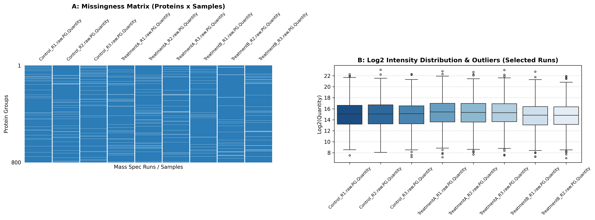

### Overview
- **Purpose**: Evaluate dataset completeness, detect missingness mechanisms (MCAR, MAR, MNAR), identify univariate/multivariate outliers, and verify data integrity prior to statistical modeling.
- **Use Case**: Initial exploratory data analysis (EDA) for proteomics, transcriptomics, metabolomics, or clinical cohort studies.
- **Prerequisites**: Continuous numerical abundance matrix.
- **Output**: Dual-panel quality plot (`01_data_quality_assessment.png`) featuring missingness matrix and outlier boxplots.

#### When to Use

| Situation | Recommended Approach | Note |
| :--- | :--- | :--- |
| **New / Unprocessed Dataset** | Complete Data Quality Pipeline (`df.info()`, `df.describe()`, `missingno`) | Mandatory first step before any downstream transformation |
| **Suspected Systematic Loss** | Missingness Matrix & Heatmap (`missingno.matrix()`, `missingno.heatmap()`) | Identifies MNAR patterns (e.g. low-abundance proteins below LOD) |
| **Heavy-Tailed / Skewed Data** | IQR-based Outlier Detection ($Q_1 - 1.5 \cdot IQR$, $Q_3 + 1.5 \cdot IQR$) | Robust against non-normal distributions unlike standard Z-score |
| **High-Dimensional Omics** | Zero & Sparsity Inspection | Identifies technical dropouts vs biological true zeros |

### Python Libraries & Methods

| Aspect | `missingno` | `pandas` | `seaborn` / `matplotlib` |
| :--- | :--- | :--- | :--- |
| **Main Function** | Missing data visualization | Quality metrics & filtering | Distribution & outlier plots |
| **Key Methods** | `msno.matrix()`, `msno.heatmap()` | `df.isna().sum()`, `df.quantile()` | `sns.boxplot()`, `sns.histplot()` |
| **Best For** | Sparsity & pattern inspection | IQR outlier calculation & stats | High-resolution publication plots |

### Quick Start Code

```bash
python 01_data_quality_assessment.py
```

### Output Example

