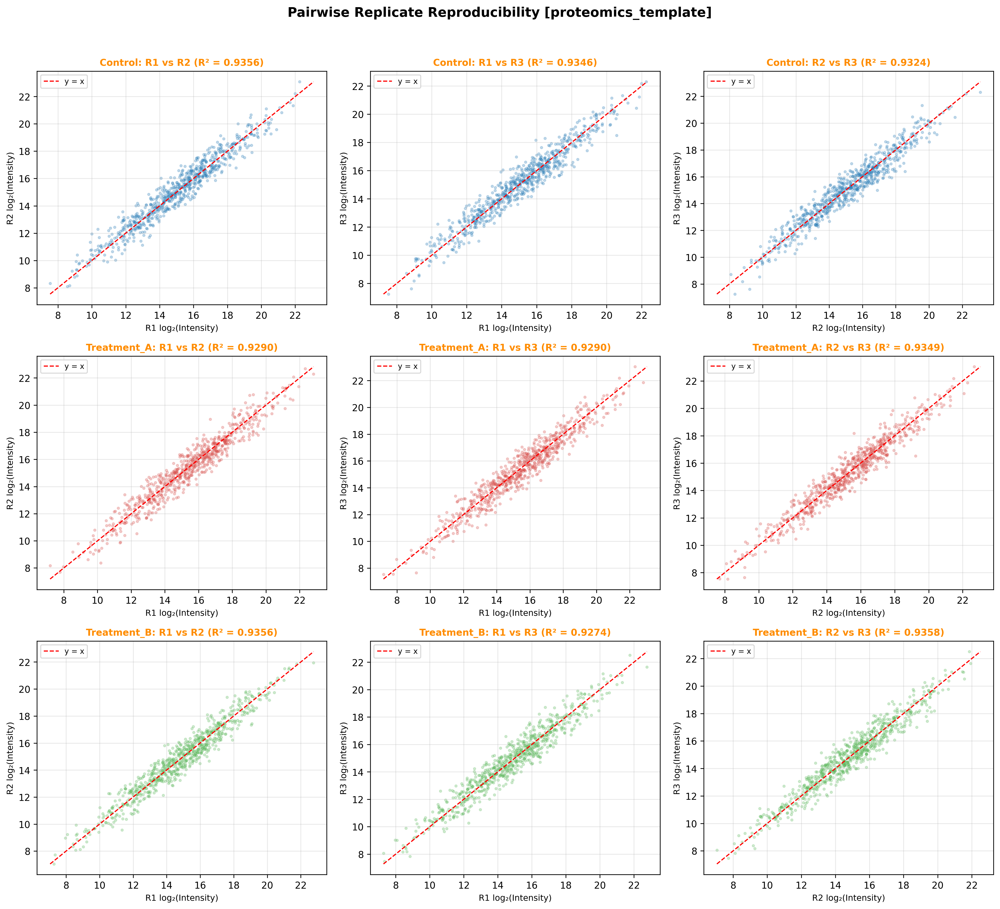

### Overview
- **Purpose**: Assess technical and biological reproducibility across replicates within experimental conditions via pairwise scatter plots and determination coefficients ($R^2$).
- **Use Case**: Quality control in mass spectrometry proteomics (DIA-NN / Spectronaut / MaxQuant) and RNA-seq prior to statistical pooling or differential expression testing.
- **Prerequisites**: Continuous abundance matrix with replicate column groupings.
- **Output**: Multi-panel pairwise scatter grid (`pairwise_scatter_proteomics_template.png`) with identity line ($y=x$), Pearson $R^2$, and reproducibility assessment.

#### When to Use

| Situation | Recommended Approach | Decision |
| :--- | :--- | :--- |
| **Replicate QC** | Pairwise Scatter within Biological Groups | $R^2 \ge 0.95$ indicates high technical precision |
| **Outlier Replicate Detection** | Compare Replicate Pairs against Cohort | Systematic deviation from $y=x$ indicates batch effect or loading issue |
| **Dynamic Range Check** | Log2 Intensity Scatter | Detects non-linear compression at low/high intensity limits |

### R vs Python

| Aspect | R (`GGally` / `ggplot2`) | Python (`matplotlib` / `scipy`) |
| :--- | :--- | :--- |
| **Matrix Plot** | `ggpairs(df, lower=list(continuous="smooth"))` | `plt.subplots()`, `scipy.stats.pearsonr()` |
| **Identity Line** | `geom_abline(slope=1, intercept=0)` | `ax.plot([min, max], [min, max], 'r--')` |
| **Performance** | Fast on small matrices | Scalable to high-throughput omics |

### Quick Start Code

```bash
python 01b_pairwise_replicate_scatter.py
```

### Output Example

