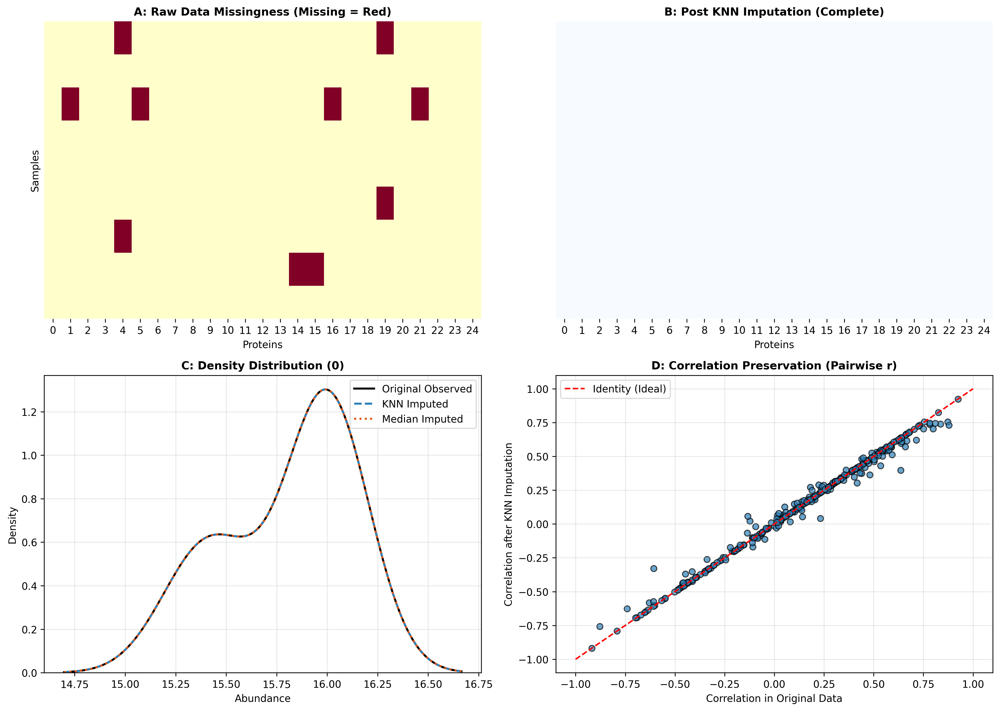

### Overview
- **Purpose**: Handle missing values in high-dimensional biological data using appropriate imputation algorithms while preserving covariance structure and minimizing bias.
- **Mechanisms**:
  - **MCAR** (Missing Completely at Random): Technical random failure.
  - **MAR** (Missing at Random): Missingness depends on observed covariates.
  - **MNAR** (Missing Not at Random): Missingness caused by low abundance below detection limit (LOD).
- **Use Case**: Quantitative proteomics, metabolomics, single-cell analysis.
- **Output**: 4-Panel diagnostic figure (`02_missing_data_handling.png`) evaluating missingness pattern, post-imputation completeness, density conservation, and correlation preservation.

#### Imputation Strategy Decision Table

| Missing Mechanism | Missingness % | Recommended Algorithm | Tool / Function |
| :--- | :--- | :--- | :--- |
| **MCAR / MAR** | $< 20\%$ | k-Nearest Neighbors (k-NN) | `sklearn.impute.KNNImputer` |
| **MCAR / MAR (Complex)** | $< 30\%$ | MissForest / Iterative SVD | `sklearn.impute.IterativeImputer` |
| **MNAR (Low Abundance)** | Any % | Left-censored MinProb / QRILC | Downshifted Normal Imputation |
| **Extreme Missingness** | $> 50\%$ | Filter feature completely | `df.dropna(thresh=...)` |

### Quick Start Code

```bash
python 02_missing_data_handling.py
```

### Output Example

