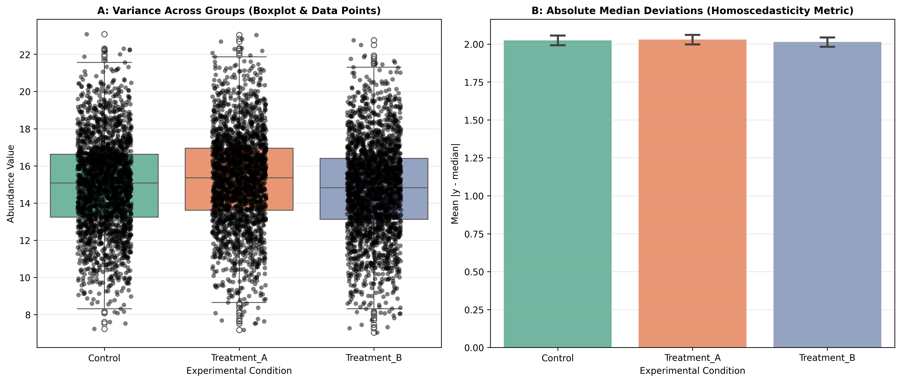

### Overview
- **Purpose**: Test the assumption of equal variances across two or more biological groups (homoscedasticity) before running ANOVA or Student's t-test.
- **Tests**:
  - **Levene's Test (Brown-Forsythe)**: Robust against non-normal distributions (uses group medians).
  - **Bartlett's Test**: Optimal power under strict normality, highly sensitive to non-normality.
  - **Fligner-Killeen Test**: Non-parametric rank-based test robust against outliers.
- **Use Case**: Assay validation, multi-group comparative omics.
- **Output**: Dual-panel variance diagnostic plot (`02_variance_homogeneity_tests.png`).

#### Decision Guide

| Distribution | Recommended Test | Action if $p < 0.05$ (Heteroscedastic) |
| :--- | :--- | :--- |
| **Normal Distributions** | Bartlett's Test | Use Welch's ANOVA / Welch's t-test |
| **Non-Normal / Outliers** | Levene's Test (Median) | Use Kruskal-Wallis / Welch's ANOVA |
| **Heavy Skewness** | Fligner-Killeen Test | Log2 transformation or Non-parametric tests |

### Quick Start Code

```bash
python 02_variance_homogeneity_tests.py
```

### Output Example

