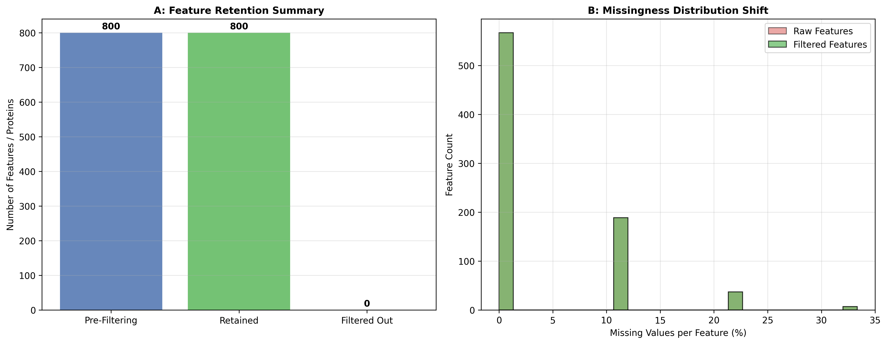

### Overview
- **Purpose**: Remove unreliable, low-abundance, and high-missingness features prior to downstream statistical modeling to reduce multiple testing burden and prevent imputation artifacts.
- **Filtering Rules**:
  - **Condition-Specific Completeness**: Feature must have valid quantitative values in $\ge 70\%$ of replicates in *at least one* biological group (preserves on/off binary markers).
  - **Minimum Intensity Threshold**: Filters baseline noise below instrument sensitivity.
- **Output**: 2-Panel summary figure (`03_abundance_filtering.png`).

#### Decision Guide

| Criterion | Recommended Cutoff | Rationale |
| :--- | :--- | :--- |
| **Replicate Completeness** | $\ge 70\%$ valid in $\ge 1$ group | Captures true biological condition-specific expression |
| **Global Completeness** | $\ge 50\%$ total valid values | Eliminates noisy uninformative background signals |
| **Minimum Signal-to-Noise** | $\ge 	ext{LOD} + 3\sigma_{	ext{blank}}$ | Prevents false positives from baseline noise |

### Quick Start Code

```bash
python 03_abundance_threshold_filtering.py
```

### Output Example

