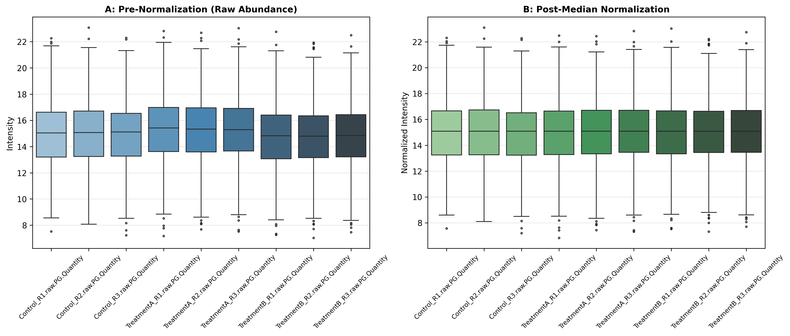

### Overview
- **Purpose**: Adjust for technical batch effects, sample loading discrepancies, and differences in total measurement depth.
- **Methods**:
  - **Median Normalization**: Centers sample medians to a shared baseline (robust against asymmetric biological regulation).
  - **Quantile Normalization**: Forces identical empirical distributions across all runs.
  - **Z-Score Standardization**: Centers each feature to mean 0, variance 1.
- **Output**: 2-Panel pre/post normalization boxplot figure (`04_normalization_and_scaling.png`).

#### Normalization Strategy Guide

| Method | Best For | Assumption |
| :--- | :--- | :--- |
| **Median Normalization** | Proteomics / Metabolomics | Most features are not differentially abundant |
| **Quantile Normalization** | Microarrays / DDA Proteomics | Identical global distribution across all samples |
| **Z-Score Standardization** | Machine Learning / Heatmaps | Feature comparability across different dynamic ranges |

### Quick Start Code

```bash
python 04_normalization_zscore_scaling.py
```

### Output Example

