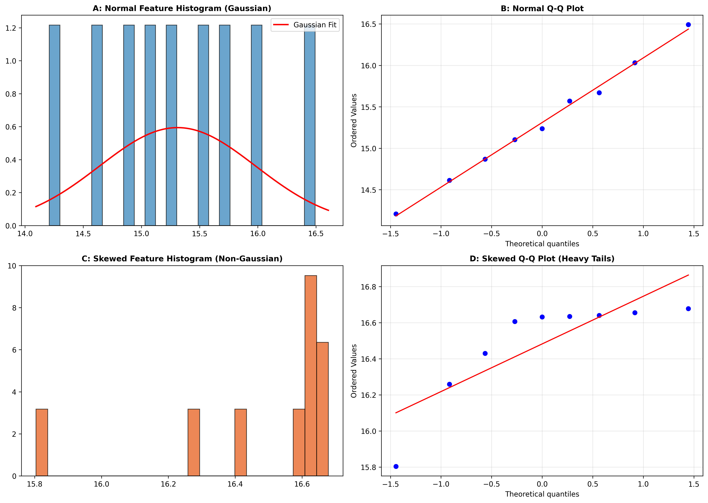

### Overview
- **Purpose**: Determine whether sample distributions conform to normality to guide the selection of parametric (t-test, ANOVA, Pearson) vs non-parametric (Mann-Whitney, Kruskal-Wallis, Spearman) statistical methods.
- **Key Tests**:
  - **Shapiro-Wilk ($W$)**: Most powerful test for moderate sample sizes ($n < 50$).
  - **D'Agostino-Pearson ($	ext{omnibus}$)**: Combines skewness and kurtosis.
  - **Quantile-Quantile (Q-Q) Plot**: Visual assessment of tail deviations.
- **Output**: 4-Panel normality diagnostic figure (`05_shapiro_wilk_normality.png`).

#### Decision Guide

| Sample Size | Shapiro-Wilk $p$-value | Recommended Statistical Method |
| :--- | :--- | :--- |
| **$n < 30$** | $p \ge 0.05$ (Normal) | Student's t-test / One-way ANOVA |
| **$n < 30$** | $p < 0.05$ (Non-Normal) | Mann-Whitney U / Kruskal-Wallis |
| **$n > 100$** | Any (CLT applies) | Parametric tests robust via Central Limit Theorem |

### Quick Start Code

```bash
python 05_shapiro_wilk_normality_test.py
```

### Output Example

