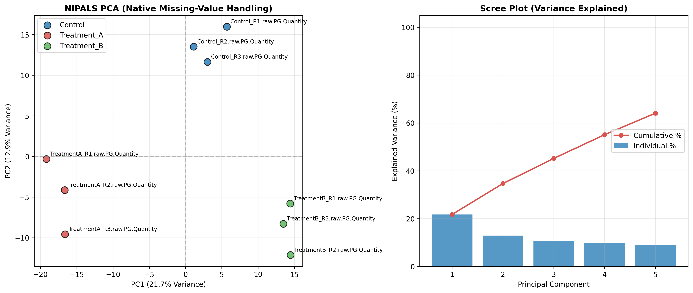

### Overview
- **Purpose**: Perform Principal Component Analysis (PCA) directly on incomplete high-dimensional omics matrices containing missing values (NaNs) **without prior imputation**.
- **Mechanism**: The **NIPALS** (Nonlinear Iterative Partial Least Squares / Wold 1966) algorithm calculates principal components through iterative expectation-maximization projections, estimating scores and loadings using only observed data points.
- **Use Case**: Proteomics (DIA-NN / Spectronaut / MaxQuant) and metabolomics where missingness is high (5-25%) and imputation (k-NN, median, zero) risks introducing false-positive covariance or distorting biological variation.
- **Output**: 2-Panel PCA diagnostic (`05b_nipals_no_imputation_pca.png`) with PC1 vs PC2 score ordination and variance Scree plot.

#### When to Use

| Situation | Recommended Approach | Reason |
| :--- | :--- | :--- |
| **High Missingness ($>10\%$)** | NIPALS No-Imputation PCA | Avoids artificial cluster formation induced by imputation artifacts |
| **Complete / Fully Imputed Data** | Standard SVD PCA (`sklearn.decomposition.PCA`) | SVD is computationally faster when matrix is complete |
| **Sparse Single-Cell Omics** | NIPALS / Probabilistic PCA (PPCA) | Accommodates extreme dropout rates without zero-inflation bias |

### Quick Start Code

```bash
python 05b_nipals_no_imputation_pca.py
```

### Output Example

