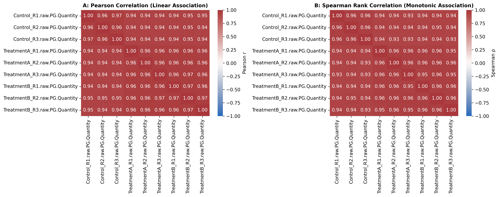

### Overview
- **Purpose**: Quantify linear (Pearson $r$) and monotonic (Spearman $
ho$) dependencies between biomarkers or experimental samples.
- **Use Case**: Co-expression networks, biomarker clustering, replicate concordance.
- **Output**: Dual-panel correlation heatmap comparison (`06_correlation_analysis.png`).

#### Decision Guide

| Relationship | Recommended Metric | Robustness |
| :--- | :--- | :--- |
| **Linear Gaussian** | Pearson Correlation ($r$) | Sensitive to outliers |
| **Non-Linear Monotonic** | Spearman Rank Correlation ($
ho$) | Robust to outliers & non-normal distributions |
| **Small Sample / Ties** | Kendall's Tau ($	au$) | Conservative, high statistical accuracy |

### Quick Start Code

```bash
python 06_pearson_spearman_correlation.py
```

### Output Example

