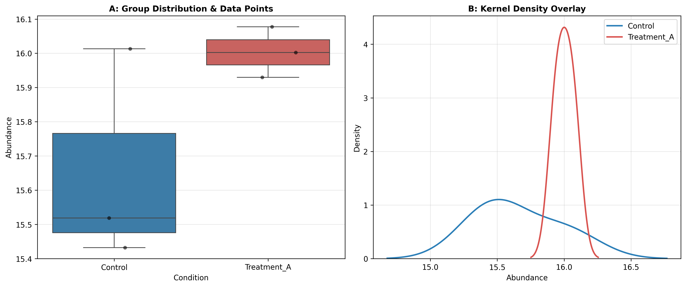

### Overview
- **Purpose**: Test for significant differences in mean or median biomarker abundance between two independent experimental groups.
- **Tests**:
  - **Welch's t-test**: Default recommendation for continuous biological data (does not assume equal variances).
  - **Student's t-test**: Assumes normality and homoscedasticity.
  - **Mann-Whitney U Test**: Non-parametric rank-sum test for skewed or non-normal distributions.
- **Output**: Dual-panel two-group comparison plot (`07_two_group_comparisons.png`).

#### Decision Guide

| Assumptions Met | Recommended Test | Note |
| :--- | :--- | :--- |
| **Normal, Unequal Variance** | Welch's t-test | Gold standard in high-throughput omics |
| **Normal, Equal Variance** | Student's t-test | Only when homoscedasticity is confirmed ($p \ge 0.05$) |
| **Non-Normal / Outliers** | Mann-Whitney U Test | Robust rank-based alternative |

### Quick Start Code

```bash
python 07_ttest_mann_whitney_utest.py
```

### Output Example

