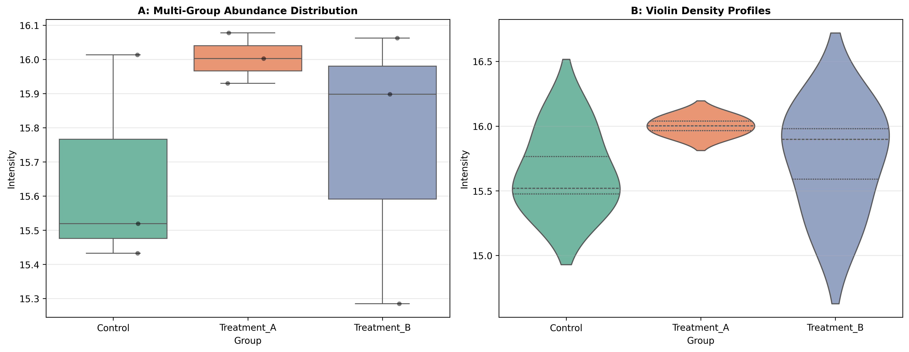

### Overview
- **Purpose**: Test for global differences in mean or median biomarker abundance across $\ge 3$ biological conditions.
- **Tests**:
  - **One-Way ANOVA**: Parametric test comparing between-group vs within-group variance ($F$-test).
  - **Kruskal-Wallis $H$-Test**: Non-parametric rank-based omnibus test.
- **Output**: Dual-panel multi-group comparison figure (`08_anova_kruskal_wallis.png`).

#### Decision Guide

| Condition | Recommended Omnibus Test | Follow-Up Analysis |
| :--- | :--- | :--- |
| **Normal & Homoscedastic** | One-Way ANOVA | Tukey's HSD Post-hoc |
| **Normal & Heteroscedastic** | Welch's ANOVA | Games-Howell Post-hoc |
| **Non-Normal / Skewed** | Kruskal-Wallis Test | Dunn's Test with BH / Bonferroni FDR |

### Quick Start Code

```bash
python 08_anova_kruskal_wallis_test.py
```

### Output Example

