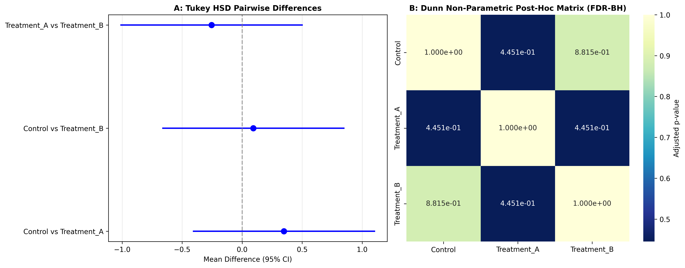

### Overview
- **Purpose**: Perform pairwise comparisons between experimental groups following a significant omnibus ANOVA or Kruskal-Wallis test while controlling the family-wise error rate.
- **Methods**:
  - **Tukey's HSD (Honestly Significant Difference)**: Parametric post-hoc test based on the studentized range distribution.
  - **Dunn's Test**: Non-parametric rank-based pairwise comparison with FDR / Bonferroni adjustment.
- **Output**: 2-Panel post-hoc diagnostic figure (`09_1_posthoc_tests.png`).

#### Decision Guide

| Omnibus Test | Homoscedasticity | Recommended Post-Hoc Test |
| :--- | :--- | :--- |
| **Standard ANOVA** | Equal Variance ($p \ge 0.05$) | Tukey's HSD |
| **Welch's ANOVA** | Unequal Variance ($p < 0.05$) | Games-Howell Test |
| **Kruskal-Wallis** | Non-parametric | Dunn's Test with Benjamini-Hochberg FDR |

### Quick Start Code

```bash
python 09_1_posthoc_tests.py
```

### Output Example

