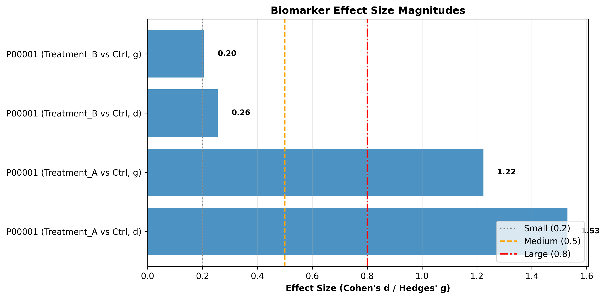

### Overview
- **Purpose**: Quantify the biological magnitude of differences between conditions independently of sample size ($p$-value dependency).
- **Metrics**:
  - **Cohen's $d$**: Standardized mean difference ($|d| \ge 0.8$ is large).
  - **Hedges' $g$**: Small-sample bias corrected version of Cohen's $d$.
  - **Eta-squared ($\eta^2$)**: Proportion of total variance explained in ANOVA models.
- **Output**: Horizontal effect size comparison barplot (`09_2_effect_size_analysis.png`).

#### Effect Size Thresholds (Cohen's Rules of Thumb)

| Magnitude | Cohen's $d$ / Hedges' $g$ | $\eta^2$ (ANOVA) |
| :--- | :--- | :--- |
| **Negligible** | $< 0.20$ | $< 0.01$ |
| **Small** | $0.20 - 0.49$ | $0.01 - 0.05$ |
| **Medium** | $0.50 - 0.79$ | $0.06 - 0.13$ |
| **Large** | $\ge 0.80$ | $\ge 0.14$ |

### Quick Start Code

```bash
python 09_2_effect_size.py
```

### Output Example

