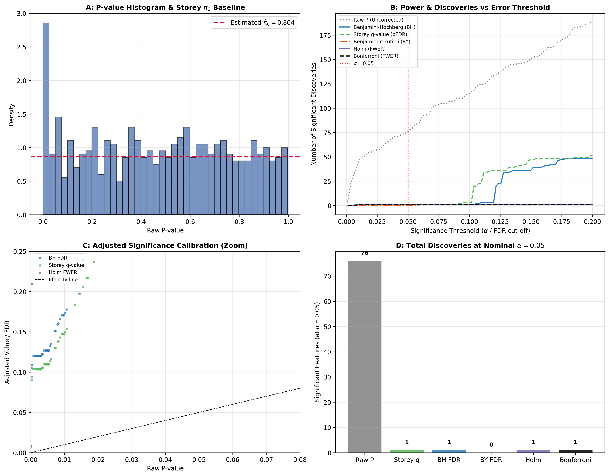

### Overview
- **Purpose**: Control statistical error rates during simultaneous testing of thousands of hypotheses ($m \sim 10^3 - 10^6$), distinguishing true biological signals from stochastic false positives.
- **Error Control Frameworks**:
  1. **Family-Wise Error Rate (FWER)**: Probability of making $\ge 1$ Type I error across all tests: $\text{FWER} = P(V \ge 1) \le \alpha$.
  2. **False Discovery Rate (FDR)**: Expected proportion of false discoveries among rejected hypotheses: $\text{FDR} = \mathbb{E}\left[\frac{V}{\max(R, 1)}\right] \le \alpha$.
- **Use Case**: High-throughput mass spectrometry proteomics, transcriptomics (RNA-seq), metabolomics, and GWAS biomarker screening.
- **Output**: 4-Panel multiple testing calibration figure (`09_3_false_discovery_rate.png`) containing p-value histogram with $\hat{\pi}_0$ baseline, discovery curves across error thresholds, adjusted p-value trajectories, and discovery counts.

---

### Theoretical & Mathematical Foundations (Postdoc Level)

#### 1. FWER Procedures (Conservative Control)
- **Bonferroni (1936)**: Single-step union bound correction:
  $$\tilde{p}_i = \min(1, m \cdot p_i)$$
- **Holm-Bonferroni (1979)**: Step-down sequential procedure:
  $$\tilde{p}_{(i)} = \min\left(1, \max_{j \le i} (m - j + 1) p_{(j)}\right)$$
- **Hochberg (1988)**: Step-up sequential procedure under Simes' inequality:
  $$\tilde{p}_{(i)} = \min_{j \ge i} (m - j + 1) p_{(j)}$$

#### 2. FDR Procedures (Modern High-Throughput Standard)
- **Benjamini-Hochberg (BH 1995)**: Step-up procedure controlling FDR under PRDS:
  $$k = \max \left\{ i : p_{(i)} \le \frac{i}{m} \alpha \right\}, \quad \text{Reject } H_{(1)}, \dots, H_{(k)}$$
- **Benjamini-Yekutieli (BY 2001)**: Controls FDR under arbitrary dependence:
  $$c(m) = \sum_{i=1}^m \frac{1}{i} \approx \ln(m) + \gamma, \quad p_{(i)} \le \frac{i}{m \cdot c(m)} \alpha$$
- **Storey's Positive FDR & q-values (Storey 2002, 2003)**:
  Estimates $\pi_0 = m_0 / m$ using the flat tail of p-values:
  $$\hat{\pi}_0(\lambda) = \frac{\sum_{i=1}^m \mathbb{I}(p_i > \lambda)}{m(1 - \lambda)}, \quad q(p_{(i)}) = \min_{j \ge i} \left( \frac{\hat{\pi}_0 \cdot m \cdot p_{(j)}}{j} \right)$$
- **Local FDR ($\text{locFDR}$, Efron 2004)**: Pointwise posterior probability of being false discovery:
  $$\text{locFDR}(z) = P(\text{Null} \mid Z = z) = \frac{\pi_0 f_0(z)}{f(z)}$$
- **Independent Hypothesis Weighting (IHW, Ignatiadis et al. 2016)**: Modulates individual hypothesis weights $w_i \ge 0$ using an independent informative covariate (e.g. mean protein abundance).

---

### Quick Start Code

```bash
python 09_3_false_discovery_rate.py
```

### Output Example

