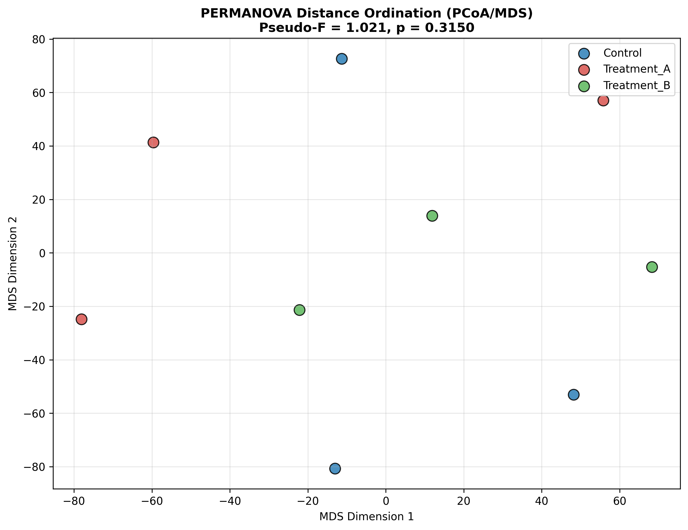

### Overview
- **Purpose**: Test for statistically significant differences in global multivariate community or abundance profiles across experimental factors using non-parametric distance-based permutations.
- **Tests**:
  - **PERMANOVA (Permutational Multivariate ANOVA)**: Partitioning distance matrices by pseudo-$F$ statistics.
  - **ANOSIM (Analysis of Similarities)**: Compares ranked within-group vs between-group dissimilarity ($R$ statistic).
- **Output**: MDS distance ordination plot (`09_multivariate_anosim_permanova.png`).

#### Decision Guide

| Metric | Permutation Test | Robustness |
| :--- | :--- | :--- |
| **Euclidean / Correlation** | PERMANOVA (Pseudo-$F$) | Partitioning sums of squares, sensitive to dispersion |
| **Bray-Curtis / Jaccard** | ANOSIM ($R$ statistic) | Pure rank-based dissimilarity |

### Quick Start Code

```bash
python 09_anosim_permanova.py
```

### Output Example

