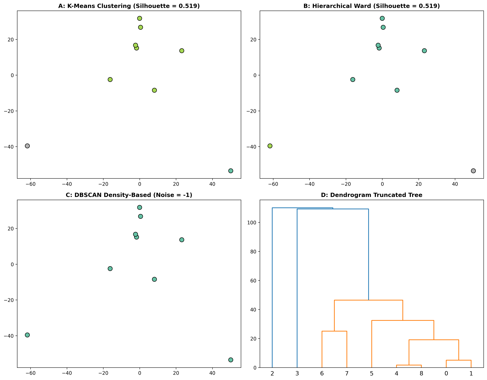

### Overview
- **Purpose**: Identify discrete phenotypic sub-cohorts and biomarker clusters without prior knowledge of class labels.
- **Algorithms**:
  - **K-Means**: Spherical centroid partitioning (requires specifying $k$).
  - **Hierarchical (Ward Linkage)**: Tree-based agglomeration with dendrogram pruning.
  - **DBSCAN**: Density-based spatial clustering capable of discovering arbitrary shapes and isolating technical outliers/noise.
- **Output**: 4-Panel clustering comparison figure (`10_unsupervised_clustering.png`).

#### Algorithm Selection Matrix

| Geometry | Recommended Algorithm | Strength |
| :--- | :--- | :--- |
| **Spherical, Equal Size** | K-Means | Fast, scalable, centroid interpretation |
| **Hierarchical Structure** | Agglomerative (Ward) | Dendrogram visualization, nested clusters |
| **Non-Convex / Noise** | DBSCAN | Does not force outliers into clusters |

### Quick Start Code

```bash
python 10_kmeans_hierarchical_dbscan_clustering.py
```

### Output Example

