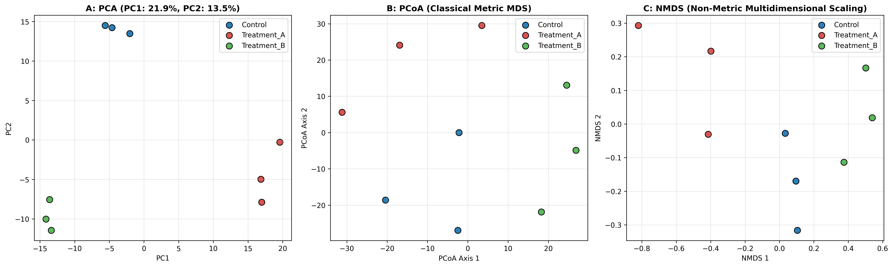

### Overview
- **Purpose**: Reduce high-dimensional biological feature spaces into 2D/3D representations to reveal global sample clustering, batch effects, and gradient trajectories.
- **Methods**:
  - **PCA (Principal Component Analysis)**: Maximizes variance along linear orthogonal axes.
  - **PCoA (Principal Coordinate Analysis / Classical MDS)**: Preserves distance metrics across samples.
  - **NMDS (Non-Metric Multidimensional Scaling)**: Preserves rank-order dissimilarity.
- **Output**: 3-Panel multivariate ordination comparison (`11_multivariate_ordination.png`).

#### Ordination Method Matrix

| Method | Distance Metric | Linearity | Best For |
| :--- | :--- | :--- | :--- |
| **PCA** | Euclidean | Linear | Quantitative Proteomics / RNA-seq |
| **PCoA** | Any (Bray-Curtis, Gower) | Metric | Ecogenomics, Microbiome, Complex distances |
| **NMDS** | Any | Non-Metric (Ranks) | Non-linear community gradients |

### Quick Start Code

```bash
python 11_pca_pcoa_nmds_ordination.py
```

### Output Example

