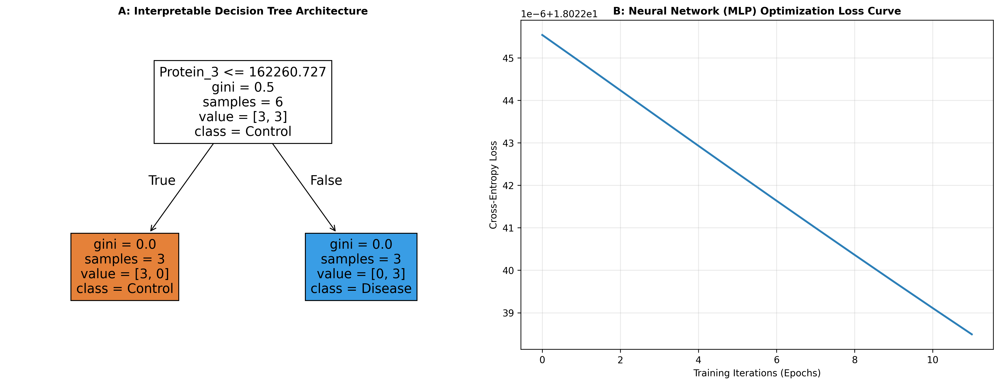

### Overview
- **Purpose**: Compare white-box interpretable decision rules (Decision Trees) against non-linear pattern learners (Multi-Layer Perceptrons) for phenotype prediction.
- **Output**: 2-Panel architecture diagnostic (`12_decision_trees_and_neural_nets.png`).

#### Decision Matrix

| Model | Interpretability | Sample Size Requirement | Overfitting Risk |
| :--- | :--- | :--- | :--- |
| **Decision Tree** | High (Rule based) | Small ($n < 100$) | High without pruning |
| **Neural Net (MLP)** | Low (Black box) | Moderate to Large ($n > 100$) | Controlled via weight decay |

### Quick Start Code

```bash
python 12_decision_trees_neural_networks.py
```

### Output Example

