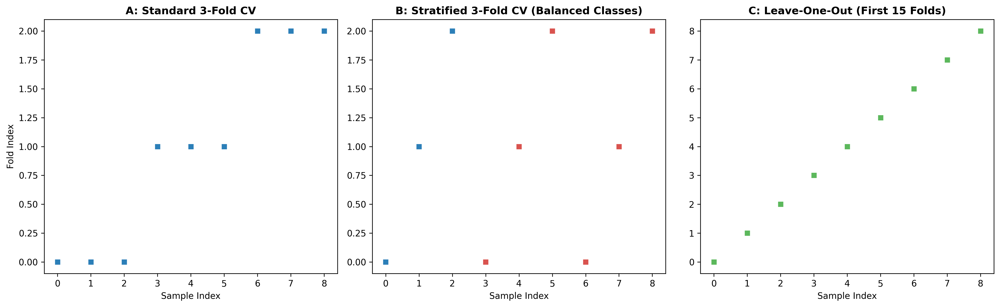

### Overview
- **Purpose**: Prevent data leakage, assess generalization performance, and select optimal hyperparameters.
- **Schemes**:
  - **Stratified K-Fold**: Preserves phenotype class proportions across all training/validation splits.
  - **Repeated K-Fold**: Averages across multiple random splits to stabilize performance estimates.
  - **Leave-One-Out (LOOCV)**: Maximizes training data in very small sample size clinical cohorts ($n < 30$).
- **Output**: 3-Panel cross-validation split diagnostic (`13_cross_validation.png`).

### Quick Start Code

```bash
python 13_cross_validation.py
```

### Output Example

