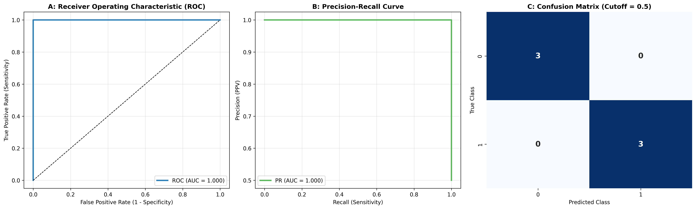

### Overview
- **Purpose**: Rigorously evaluate biomarker diagnostic accuracy, sensitivity, specificity, and classification calibration.
- **Metrics**:
  - **ROC-AUC**: Overall discriminatory power across all discrimination thresholds.
  - **Precision-Recall (PR) AUC**: Superior metric for imbalanced disease cohorts.
  - **Confusion Matrix**: Quantitative breakdown of TP, FP, TN, FN.
- **Output**: 3-Panel diagnostic performance figure (`14_model_evaluation_metrics.png`).

### Quick Start Code

```bash
python 14_model_evaluation_metrics.py
```

### Output Example

