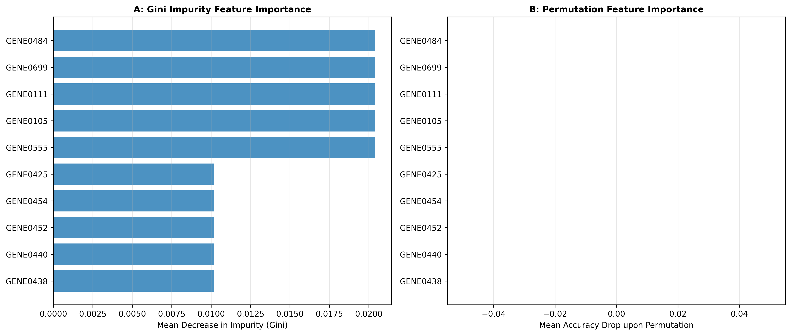

### Overview
- **Purpose**: Ensemble decision tree classification and robust biomarker ranking for high-dimensional omics data.
- **Importance Metrics**:
  - **Mean Decrease Impurity (Gini)**: Fast tree-level split metric.
  - **Permutation Importance**: Out-of-bag validation drop metric (unbiased by cardinality).
- **Output**: 2-Panel feature importance ranking (`15_random_forests.png`).

### Quick Start Code

```bash
python 15_random_forests.py
```

### Output Example

