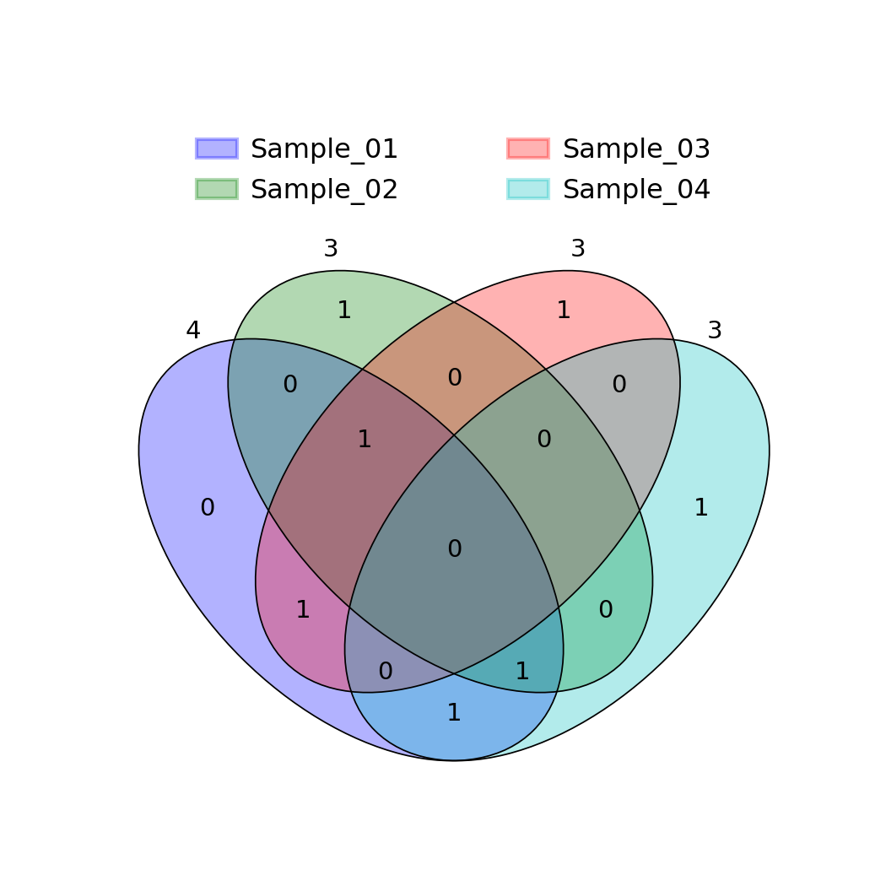
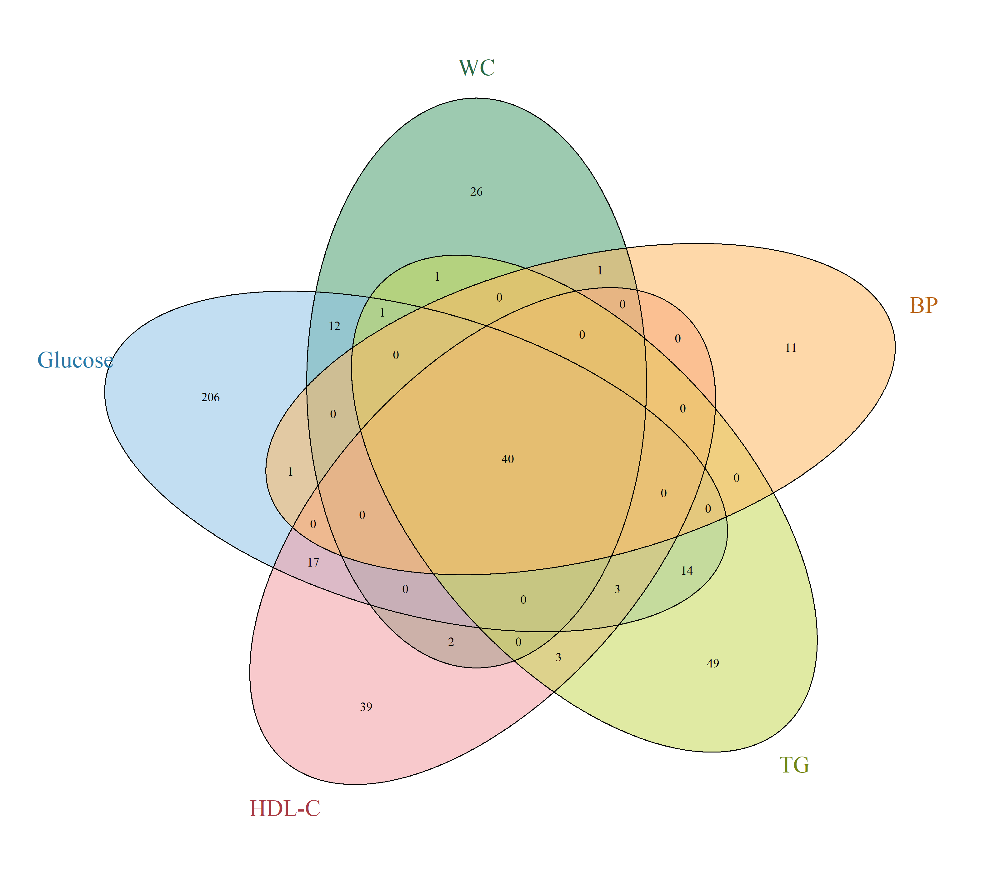
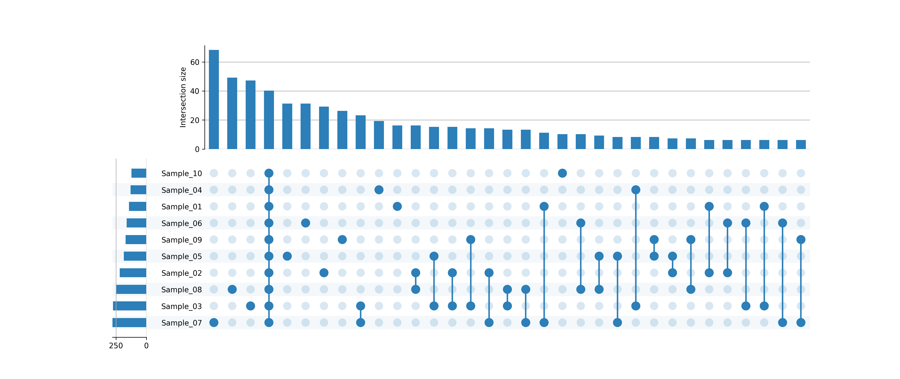

### Overview
- **Purpose**: Visualize intersections, overlaps, and unique subsets among experimental conditions, sample cohorts, or gene/protein lists.
- **Approaches**:
  - **4-Way Venn Diagram (`venny4.png`)**: Classical visualization for up to 4 sets with proportional areas.
  - **5-Way Venn Diagram (`venn_5_random_samples.png`)**: Multi-set elliptical diagram for 5 experimental conditions.
  - **UpSet Plot (`upsetplot`)**: Scalable matrix-based intersection visualization for $\ge 5$ sets, eliminating unreadable Venn overlaps.
- **Output**: Multi-set diagrams (`venny4.png`, `venn_5_random_samples.png`, `upset_10_random_samples.png`).

### Quick Start Code

```bash
python 16_venn_diagrams_upset_plots.py
```

### Output Examples

#### 1. 4-Way Venn Diagram


#### 2. 5-Way Venn Diagram


#### 3. High-Dimensional UpSet Plot (10 Cohorts)

