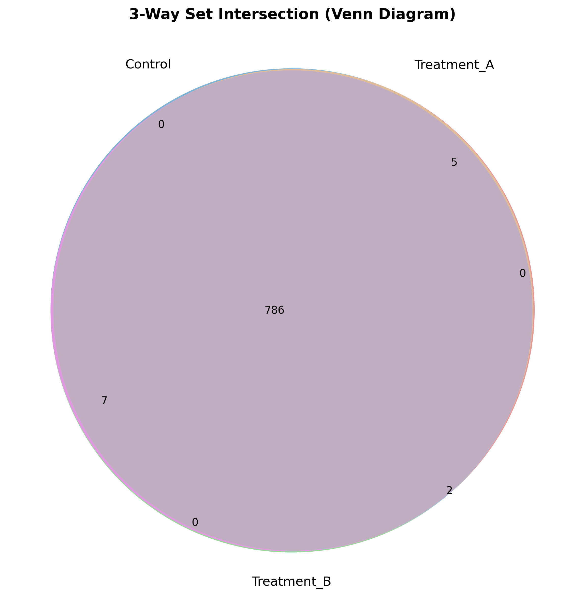

### Overview
- **Purpose**: Visualize intersections, overlaps, and unique subsets among experimental conditions or gene lists.
- **Approaches**:
  - **3-Way Venn Diagram**: Classical visualization for 2 to 3 sets.
  - **UpSet Plot**: Scalable matrix-based intersection visualization for $\ge 4$ sets.
- **Output**: Styled Venn overlap diagram (`16_venn_upset_plots.png`) and region summary tables.

### Quick Start Code

```bash
python 16_venn_diagrams_upset_plots.py
```

### Output Example

