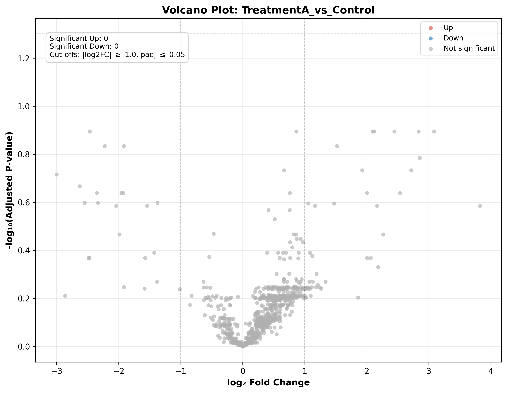

### Overview
- **Purpose**: Simultaneously visualize magnitude of change ($\log_2 	ext{Fold Change}$) and statistical significance ($-\log_{10} p_{	ext{adj}}$) to identify biologically and statistically significant candidate biomarkers.
- **Use Case**: Differential abundance analysis in proteomics (DIA-NN / Spectronaut / MaxQuant) and differential expression in RNA-seq (DESeq2 / edgeR).
- **Output**: Publication-ready Volcano plot (`17_volcano_plots.png`) with color-coded regulation tiers and top biomarker annotations.

#### Decision Thresholds

| Quadrant | Criteria | Biological Interpretation |
| :--- | :--- | :--- |
| **Top Right (Up)** | $\log_2 	ext{FC} \ge 	ext{threshold}$, $p_{	ext{adj}} \le lpha$ | Significantly up-regulated / induced proteins |
| **Top Left (Down)** | $\log_2 	ext{FC} \le -	ext{threshold}$, $p_{	ext{adj}} \le lpha$ | Significantly down-regulated / repressed proteins |
| **Bottom / Center (NS)** | $|\log_2 	ext{FC}| < 	ext{threshold}$ or $p_{	ext{adj}} > lpha$ | Not significantly altered |

### Quick Start Code

```bash
python 17_volcano_plots.py
```

### Output Example

