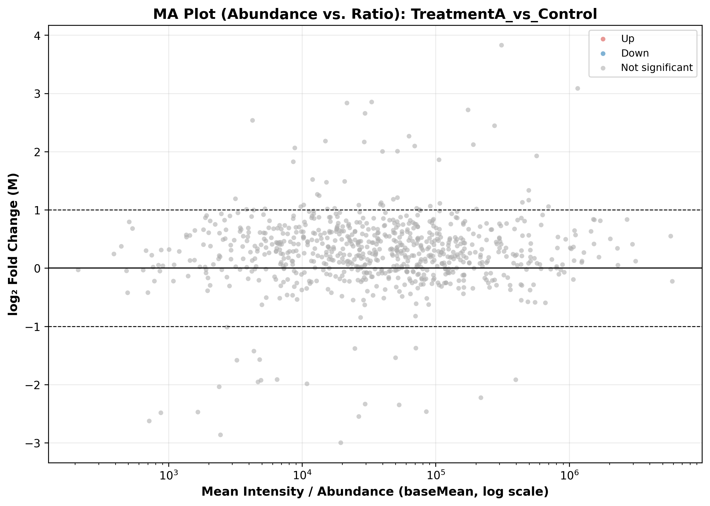

### Overview
- **Purpose**: Detect intensity-dependent biases, non-linear systematic distortions, and variance heteroscedasticity across the dynamic range.
- **Definition**: Plots $\log_2(	ext{Fold Change})$ ($M = \log_2(R/G)$) on the y-axis against Mean Abundance ($A = rac{1}{2}(\log_2(R) + \log_2(G))$) on the x-axis.
- **Use Case**: Diagnostic QC in differential expression (RNA-seq / Microarray) and quantitative proteomics.
- **Output**: High-resolution MA figure (`18_ma_plots.png`) with horizontal balance line ($M=0$) and significance thresholds.

#### When to Use

| Diagnostic Pattern | Interpretation | Remedy |
| :--- | :--- | :--- |
| **Symmetric funnel centered at $M=0$** | Well-normalized data, ideal variance behavior | Ready for downstream statistics |
| **Curved / banana shape** | Non-linear intensity-dependent dye/label bias | Apply LOESS or Quantile Normalization |
| **Offset from $M=0$** | Global loading or library size difference | Total sum or Median normalization required |

### Quick Start Code

```bash
python 18_ma_plots.py
```

### Output Example

