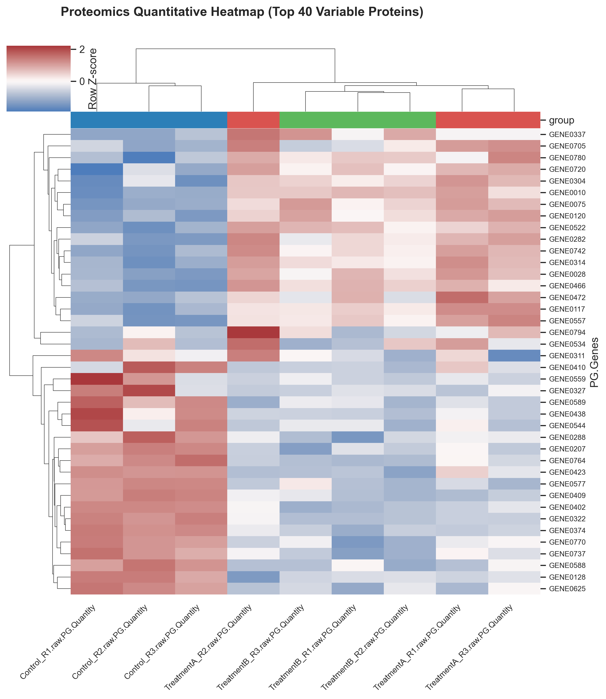

### Overview
- **Purpose**: Uncover co-expressed biomarker modules, sample clustering structure, and multi-condition phenotypic signatures using two-dimensional hierarchical clustering.
- **Components**:
  1. **Row Clustering**: Groups proteins/genes with correlated expression profiles across samples.
  2. **Column Clustering**: Groups experimental replicates and conditions based on global quantitative similarity.
  3. **Row Z-Score Standardization**: Highlights relative up/down regulation independent of baseline abundance.
- **Output**: Publication-ready hierarchical clustered heatmap (`19_clustered_heatmaps.png`) with condition annotation bar and color legend.

### Quick Start Code

```bash
python 19_clustered_heatmaps.py
```

### Output Example

